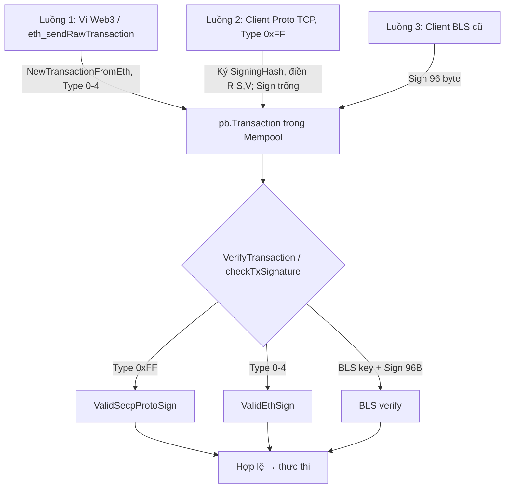

# 📐 Thiết kế: Giao dịch ký secp256k1 qua TCP bằng Protobuf (giữ tương thích client TCP cũ)

> **Trạng thái:** ĐÃ HOÀN TẤT & ĐÃ KIỂM THỬ TOÀN DIỆN — **Phương án 2 ("SigningHash riêng")**, commit `b29b5875` (+ vá guard đường batch `19a3d840`, bind chain execution `0ef49f78`, `tx_signature_mode` `749c776f`). Full test suite (unit, integration, build_check 4/4) và E2E live trên cụm 5 nodes chạy thành công 100% cho cả 2 đường TCP socket (Type 0xFF) và HTTP JSON-RPC (`eth_sendRawTransaction`), xác nhận 100% Zero-Fork và state/receipt đồng nhất.
> **Ngày:** 2026-10-04 (v1 ngày 2026-10-03 bị thay thế vì lỗi vòng lặp hash, xem §9).
> **Mục tiêu:** client TCP cũ vẫn gửi `pb.Transaction` qua TCP, chỉ đổi hàm ký từ BLS sang secp256k1 — KHÔNG phải tính RLP/sighash Ethereum.
> **Nguyên tắc:** trường `Sign` (dành cho BLS, dùng cả ở đường xuyên chain / parent chain) **không bị đụng tới**. Chữ ký secp nằm ở `R`, `S`, `V`.

---

## 0. Hai chế độ theo chain: `tx_signature_mode`

Một binary `simple_chain`, hai bộ luật xác thực chữ ký, chọn bằng cấu hình **theo chain** (`config.json`). Mọi validator của một chain PHẢI cùng giá trị — lệch là fork; đổi trên chain đã có lịch sử cần wipe + redeploy đồng loạt. Giá trị lạ làm node không khởi động (không bao giờ âm thầm rơi về luật khác).

| | `""` / `"bls_legacy"` (mặc định) — simple chain cũ | `"secp"` — node thực thi mới |
| :--- | :--- | :--- |
| Tx dapp ký BLS (`Sign` 96B + khoá BLS đăng ký) | **Giữ nguyên** | Chỉ hợp lệ với **danh tính node** (địa chỉ = `keccak(blsPubKey)[12:]`, ví dụ tx hệ thống rollup do `app.keyPair` ký). Tài khoản người dùng bị từ chối |
| Tx ETH (Type 0-4, `ValidEthSign`) | Giữ nguyên | Hợp lệ |
| Tx proto secp (Type `0xFF`) | **Từ chối** (`InvalidSign`; ingress báo "disabled on this chain") | Hợp lệ, phải đúng `ChainID` (chưa cấu hình → từ chối) |
| Bypass "sub-node lagging" (không có khoá BLS + nonce>0 ⇒ bỏ qua verify) | Giữ nguyên | **Tắt** cho tài khoản người dùng (mọi tài khoản secp đều không có khoá BLS, bypass sẽ bỏ qua verify toàn bộ) |
| RPC Private Gateway (`eth_tx_converter.go`) | Đòi khoá BLS của tài khoản, ký BLS bảo lãnh + device key | Không đòi khoá BLS, không ký lại, không device key — tx giữ chữ ký ETH |

Vì sao BLS không bị xoá hẳn ở chế độ `secp`: node thực thi tự có danh tính BLS (không có khoá secp) và tự ký tx hệ thống rollup bằng khoá BLS (`app.go`). `AccountState.PublicKeyBls` vẫn nằm trong state (attestation, kiểm tra danh tính, MVM). Các worker attestation gửi tx ký kiểu ETH, chữ ký BLS chỉ nằm trong payload nên không bị ảnh hưởng.

Chế độ `bls_legacy` giống hệt hành vi trước khi có tx `0xFF` đối với mọi tx không phải `0xFF`, nên bản binary mới chạy chung được với bản cũ trên chain legacy (node cũ cũng loại tx `0xFF` vì chữ ký không hợp lệ).

---

## 1. Bối cảnh

- Mô hình mới: khóa BLS chỉ thuộc Node/Sequencer/Cluster. Người dùng là tài khoản EVM thường, ký `secp256k1`.
- Client TCP cũ (`SendTransactionWithDeviceKey`) đòi tài khoản có `PublicKeyBls` đăng ký on-chain và ký BLS trên `tx.Hash()` → bị reject (`InvalidSign`, mã 66) với tài khoản chỉ có secp.
- `Sign` đã bị dùng chung: luồng ETH hiện tại ghi `r‖s‖v` (65 byte) vào `Sign` (`eth_legacy.go:152`), còn parent chain đọc `Sign` đúng 96 byte BLS (`parentchain/tx.go` `VerifyTxSignature`), và `signature_enforcement.go` đưa `tx.Sign()` vào batch-verify BLS. → **Không thêm một nghĩa nữa vào `Sign`.**

## 2. Vì sao v1 sai (vòng lặp hash)

`TransactionHashData` chứa `R`, `S`, `V` (`transaction.proto` tag 13-15) và `Transaction.Hash()` dùng cả ba (`transaction.go:659`).
Nếu client ký `tx.Hash()` rồi điền R,S,V thì hash lúc node kiểm tra ≠ hash lúc ký → recover sai người gửi. v1 chỉ chạy vì R,S,V để trống và chữ ký nằm trong `Sign`.

**Giải pháp:** tách hai khái niệm hash.

| Hash | Định nghĩa | Dùng để |
| :--- | :--- | :--- |
| `SigningHash()` (MỚI) | `keccak256(proto.Marshal(TransactionHashData))` với `R`,`S`,`V` **để trống** (mọi trường khác y như `Hash()`) | Hash mà client ký secp |
| `Hash()` (giữ nguyên) | như cũ, gồm cả `R`,`S`,`V` | Định danh tx (giống tx hash của Ethereum bao gồm chữ ký) |

Client cũ vốn đã tính được hàm này (nó chính là `tx.Hash()` lúc R,S,V còn trống) → chỉ cần đổi hàm ký.

## 3. Đặc tả

### 3.1 Loại giao dịch
`Type = 0xFF` (255) = "giao dịch Proto ký secp". Không đụng tới Type Ethereum 0-4.

### 3.2 Quy cách client
1. Dựng `pb.Transaction`: `FromAddress`, `ToAddress`, `Amount`, `Nonce`, `Data`, `MaxGas`, `MaxGasPrice`, `ChainID` (**bắt buộc ≠ 0 và đúng chain đích**), `Type = 0xFF`. Để trống `R`,`S`,`V`,`Sign`.
2. `h = SigningHash(tx)` (= `Hash()` khi R,S,V trống).
3. `sig = secp256k1.Sign(h, privKey)` → 65 byte `[R(32) | S(32) | recoveryID(1)]`, `recoveryID ∈ {0,1}`.
4. Điền: `tx.R = sig[0:32]`, `tx.S = sig[32:64]`, `tx.V = sig[64:65]` (đúng 1 byte `0x00`/`0x01`). **`Sign` để trống.**
5. Gửi qua TCP lệnh `SendTransaction` (không dùng `SendTransactionWithDeviceKey`).

> Định dạng cố định (không dùng `big.Int.Bytes()` vốn cắt số 0 đầu và biến `V=0` thành rỗng): `R`,`S` đúng 32 byte, `V` đúng 1 byte. Nếu cho phép nhiều cách mã hoá thì cùng một chữ ký sinh nhiều `Hash()` khác nhau (malleability).

### 3.3 Quy tắc node (hàm thuần, xác định)
Thêm vào `pkg/transaction/transaction.go`:

```go
// SigningHash: hash that the secp signer signs. Same fields as Hash() but R,S,V cleared.
func (t *Transaction) SigningHash() common.Hash

// ValidSecpProtoSign: Type==0xFF && len(R)==32 && len(S)==32 && len(V)==1 && V<=1 &&
// ChainID != 0 && s is low (s <= N/2) && len(Sign)==0 &&
// ecrecover(SigningHash(), R||S||V) == FromAddress.
func (t *Transaction) ValidSecpProtoSign() bool

// ValidSecpSign: single seam used by every call site.
func (t *Transaction) ValidSecpSign() bool {
    if t.Type() == 0xFF { return t.ValidSecpProtoSign() }
    return t.ValidEthSign()
}
```
Kiểm tra `ChainID` khớp chain của node nằm ở ingress (xem §4), vì `Transaction` không biết cấu hình node.

## 4. Các điểm phải sửa (đã đối chiếu với code)

Mọi chỗ gọi `ValidEthSign()` hiện có phải đổi thành `ValidSecpSign()`, và nhánh BLS phải bị bỏ qua với `Type == 0xFF`. **Hai hàm xác thực phải cho cùng kết quả**, nếu lệch thì tx lọt mempool nhưng bị loại lúc thực thi block.

| File | Vị trí | Việc cần làm |
| :--- | :--- | :--- |
| `pkg/transaction/transaction.go` | mới | `SigningHash`, `ValidSecpProtoSign`, `ValidSecpSign` |
| `pkg/blockchain/tx_processor/validation.go` | khối BLS (~212-246) | Nếu `Type==0xFF`: bỏ qua thử BLS, gọi `ValidSecpSign()`; ngược lại giữ nguyên. Tránh log `BLS Verification Failed!` giả |
| `.../validation.go` | ~260 (`AccountType==1` → `RequiresTwoSignatures`) | `ValidEthSign()` → `ValidSecpSign()` |
| `.../validation.go` | ~280 (`setBlsPublicKey`, nonce 0) | `ValidEthSign()` → `ValidSecpSign()` (tài khoản mới chỉ có secp vẫn đăng ký được BLS) |
| `.../signature_enforcement.go` | `checkTxSignature` (~54-60) | Bỏ qua BLS nếu `Type==0xFF`; `ValidEthSign()` → `ValidSecpSign()` (cả 2 chỗ). **Đây là bộ lọc ở bước thực thi block (consensus), bắt buộc đồng bộ với `validation.go`** |
| `.../signature_enforcement.go` | `verifySignatures` phase 1 (~160) | Điều kiện đưa vào batch BLS thêm `txs[i].Type() != 0xFF`. Nếu không, tx Sign rỗng sẽ làm hỏng cả chunk batch rồi phải bisect → tốn CPU, kẻ tấn công khuếch đại được |
| `.../signature_enforcement.go` | `sigCacheKey` | Giữ nguyên: `Hash()` đã gồm R,S,V nên cache gắn với đúng chữ ký |
| Handler TCP `SendTransaction` (ingress) | cần đọc trước khi sửa | Với `Type==0xFF`: kiểm tra `ChainID == chainID của node`, `len(Sign)==0`; rồi vào luồng xác thực chung. Gỡ yêu cầu `PublicKeyBls` cho đường này |
| `cmd/simple_chain/eth_tx_converter.go` ~65 | | KHÔNG phải đường TCP (đó là luồng RPC chuyển eth→BLS có khoá BLS). Giữ nguyên, chỉ ghi chú để không nhầm |

### 4.1 `EthHash` / RPC của Type 0xFF
`ToEthTransaction()` trả `nil` cho Type lạ (`transaction.go:286`) → `EthHash()` = hash rỗng. Cần quyết định và test:
- **Đề xuất:** tx `0xFF` dùng `Hash()` (meta hash) làm định danh duy nhất; `eth_getTransactionByHash`/`receipt` tra theo meta hash, không tạo mapping `ethHash→blsHash` cho tx này (hiện `RebuildMappingsFromBlock` bỏ qua khi `EthHash()` rỗng — đã đúng).
- Receipt: field `type` trả `0xff`; các công cụ Ethereum chuẩn có thể không hiểu — chấp nhận, vì đây là đường nội bộ cho client Proto.

## 5. Luồng tổng thể



Đường xuyên chain / parent chain không đổi: `Sign` vẫn chỉ mang BLS.

## 6. Bất biến an toàn (BẮT BUỘC kiểm chứng)

1. **Hàm thuần:** `ValidSecpSign` chỉ phụ thuộc `(tx)` — không đồng hồ, không dữ liệu cục bộ → mọi node cùng verdict (không fork).
2. **Nhất quán hai nơi:** `VerifyTransaction` và `checkTxSignature` dùng chung `ValidSecpSign`.
3. **Low-s:** từ chối `s > N/2` để mỗi chữ ký chỉ có một dạng hợp lệ.
4. **Mã hoá cố định** R(32)/S(32)/V(1) để `Hash()` không malleable.
5. **Replay chéo chain:** `ChainID` nằm trong `SigningHash` và ingress ép bằng chain của node. `ChainID == 0` bị từ chối.
6. **Không dùng `Sign`:** tx `0xFF` có `Sign` khác rỗng → từ chối (tránh nhập nhằng với BLS).
7. **Tài khoản đã có BLS key vẫn nhận tx secp:** không nâng quyền, vì khoá BLS được đăng ký bằng chữ ký secp của chính tài khoản (`setBlsPublicKey` yêu cầu chữ ký secp).

## 7. Kế hoạch test

Unit (`pkg/transaction`, `pkg/blockchain/tx_processor`):
- `SigningHash` không đổi khi điền R,S,V; `Hash()` đổi.
- Ký đúng → `ValidSecpProtoSign` true. Sai: đổi 1 trường bất kỳ (Amount, Nonce, Data, DeviceKey, MaxTimeUse) → false; high-s → false; `V∉{0,1}` → false; R/S sai độ dài → false; `ChainID` sai/0 → false; `Sign` ≠ rỗng → false; sai người gửi → false.
- Cùng một tx qua `VerifyTransaction` và `checkTxSignature` → cùng verdict (bảng quyết định đầy đủ: có/không BLS key × AccountType 0/1 × tx setBls).
- `verifySignatures` với hỗn hợp BLS + 0xFF + ETH: tx 0xFF không vào batch BLS, verdict từng tx đúng.
- Round-trip proto marshal/unmarshal qua TCP không đổi `Hash()`.
Tích hợp (cụm local): tài khoản chỉ có secp gửi chuyển tiền, gọi hợp đồng, `setBlsPublicKey`; tài khoản đã có BLS gửi bằng 0xFF; cross-chain credit vẫn đúng (`Sign` BLS không bị ảnh hưởng); receipt / `getTransactionByHash` theo meta hash; restart + `RebuildMappingsFromBlock` không lỗi với tx 0xFF; so sánh kết quả giữa các node.
- **Kết quả kiểm thử thực tế trên cụm 5 nodes (2026-10-04):** Đã kiểm thử kép (Dual-Route) trên cụm 5 nodes thực tế (`mtn-orchestrator.sh`):
  - Giao dịch Type 0xFF qua kết nối TCP socket (cổng 4201) nhận receipt `RETURNED` trong ~0.95s, nonce và balance tăng chính xác.
  - Giao dịch Ethereum qua HTTP JSON-RPC `eth_sendRawTransaction` (cổng 8757) nhận receipt status `1` trong ~1.0s, balance tăng chính xác.
  - Block hash và state root khớp 100% trên toàn bộ 5 node (Zero-Fork Invariant được bảo toàn tuyệt đối).
Chạy `build_check.sh` sau khi sửa.

## 8. Việc còn mở / rủi ro còn lại

- **Guard ingress dùng chung:** `checkSecpProtoIngress` (`tx_validator_pool_core.go`) chạy ở CẢ đường đơn (`AddTransactionToPool`) và đường batch (`AddTransactionsToPool`, lệnh `SendTransactions`): ChainID phải bằng chain của node, `Sign` phải rỗng, và node chưa cấu hình `ChainId` thì từ chối 0xFF (fail-closed).
- **ChainID và chế độ được ép lúc thực thi block:** `sigPolicy.secpProtoError(tx)` (`signature_enforcement.go`) trong `checkTxSignature` / `verifySignatures` / `FilterInvalidSignatures` / `PreVerifySignatures`, và trong `VerifyTransaction` (trả `InvalidChainId`). Hàm thuần theo `(tx, trạng thái người gửi, sigPolicy)` nên mọi validator cùng config cho cùng kết quả — **mọi validator của một chain phải có cùng `ChainId`** (đã là điều kiện bắt buộc cho opcode CHAINID). Chưa có tx 0xFF nào trong lịch sử chain, nên thay đổi này không làm đổi verdict của dữ liệu cũ.
- RPC: `ToEthTransaction()` trả `nil` cho Type 0xFF nên `EthHash` rỗng; các đường RPC hiện tại đều xử lý `nil` và dùng meta hash. Receipt trả `type = 0xff`.
- Client không phải Go cần cài cùng protobuf deterministic marshal để ra đúng `SigningHash`. Test vector cố định (khoá, tx, `SigningHash`, R/S/V, `Hash()`): `TestSecpProto_GoldenVector` trong `pkg/transaction/secp_proto_test.go` — SDK ngôn ngữ khác phải khớp từng byte.

## 9. Phương án đã loại

- **v1 (ký `tx.Hash()` rồi nhét 65 byte vào `Sign`):** vòng lặp hash khi điền R,S,V và làm quá tải `Sign` đang dành cho BLS / xuyên chain.
- **Phương án 1 (ký sighash Ethereum chuẩn, điền R,S,V, `Sign` trống):** an toàn hơn cho node (`ValidEthSign()` có sẵn, không đổi consensus) nhưng bắt client phải tự tính sighash Ethereum (RLP, theo từng Type) từ proto, và sighash Ethereum không phủ `LastDeviceKey`/`NewDeviceKey`/`MaxTimeUse`/`ReadOnly` nên cần canonical hoá ở ingress. Có thể quay lại phương án này nếu ưu tiên tương thích công cụ Ethereum hơn là giữ client cũ.
