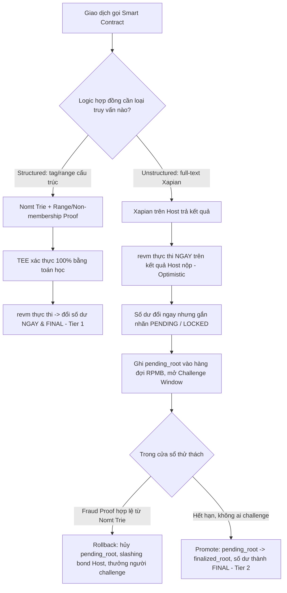
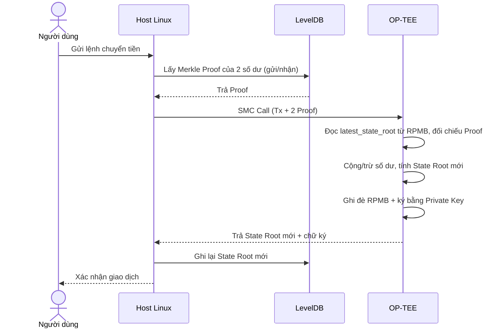
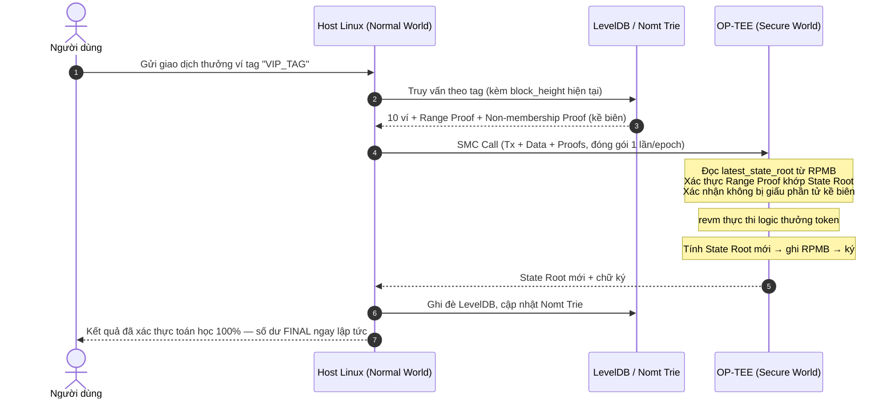
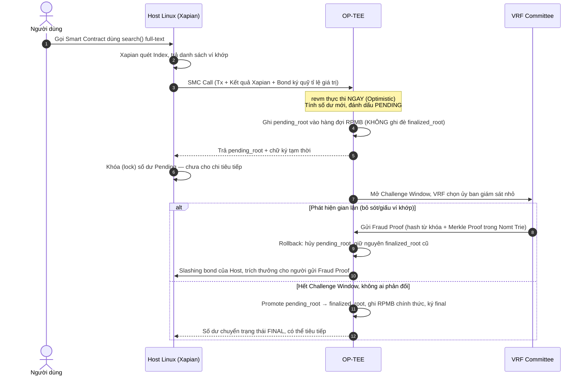
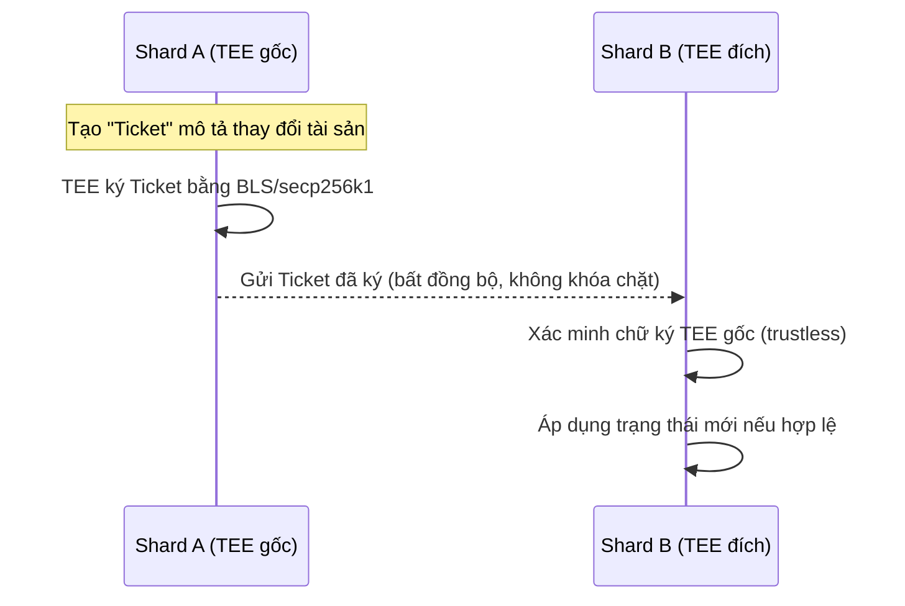

# Đề Xuất Giải Pháp Kiến Trúc: Metanode trên OP-TEE Phần Cứng Yếu

> **Loại tài liệu:** Đề xuất kỹ thuật (Technical Proposal)
> **Tài liệu tham chiếu:** Xem chi tiết triết lý kiến trúc tại [Tài Liệu Kiến Trúc Tổng Thể](tee_master_architecture.md)
> **Phạm vi:** Kiến trúc thực thi bảo mật + tìm kiếm xác thực cho chuỗi khối phụ chạy trên thiết bị giá rẻ (Orange Pi, OP-TEE/TrustZone, Secure RAM 16–32MB)
> **Mục tiêu tài liệu:** Tổng hợp lại toàn bộ phân tích kiến trúc đã có thành **một đề xuất giải pháp duy nhất, dứt khoát**, kèm mô tả luồng vận hành chi tiết để đội kỹ thuật có thể bắt tay triển khai và benchmark.

---

## 1. Tóm Tắt Đề Xuất (Executive Summary)

> **Ghi chú phiên bản (v2):** Bản đề xuất trước quy định Unstructured Search (Xapian) **không bao giờ** được phép thay đổi số dư — chỉ phục vụ UX/Explorer. Ràng buộc đó **không khớp với yêu cầu thực tế**: nhiều logic hợp đồng (ví dụ *"Airdrop cho ví có chữ VIP trong Memo"*) bắt buộc kết quả tìm kiếm full-text phải kích hoạt trực tiếp việc chuyển tiền bên trong cùng một giao dịch EVM. Phiên bản này thiết kế lại để **Xapian được phép ảnh hưởng số dư**, thông qua mô hình **Hai Tầng Finality (Two-Tier Finality)** thay vì tách rời tuyệt đối hai luồng như trước.

Bài toán cốt lõi không đổi: Orange Pi chạy OP-TEE chỉ có **16–32MB Secure RAM**, không có ổ cứng trong Secure World, nhưng hệ thống cần chạy Smart Contract có khả năng tìm kiếm/truy vấn dữ liệu lớn (full-text như Xapian) **và để kết quả đó trực tiếp đổi số dư** mà vẫn giữ được tính **trustless**.

Giải pháp đề xuất: **một luồng thực thi EVM duy nhất** (Xapian được gọi như một precompile/opcode ngay trong logic hợp đồng), nhưng đầu ra của mỗi giao dịch mang một trong hai nhãn finality:

| Tầng | Loại truy vấn dùng | Số dư thay đổi khi nào | Cơ chế xác thực |
|---|---|---|---|
| **Tier 1 — Instant Finality** | Structured Query (tag/range cấu trúc) | Ngay lập tức, không thể đảo ngược | Toán học thuần túy: Nomt Trie + Non-membership/Range Proof |
| **Tier 2 — Deferred Finality** | Unstructured Search (Xapian full-text) | Ngay lập tức nhưng ở trạng thái **Pending/Locked**, chỉ "chốt cứng" (final) sau khi qua Challenge Window | Optimistic Execution + Fraud Proof (Keyword-Nomt Mapping) + Bonding tỉ lệ thuận giá trị rủi ro |

Cả hai tầng đều cho phép `revm` **gọi Xapian như một phần của logic hợp đồng và đổi số dư trong cùng giao dịch**. Khác biệt duy nhất là thời điểm số dư trở thành final. Đây là mô hình tương tự cách Optimistic Rollup xử lý rút tiền: thực thi và cập nhật trạng thái ngay, nhưng chỉ "cứng" hoàn toàn sau cửa sổ thử thách — cho phép Xapian thực sự nằm trong đường đi tiền mà vẫn không đánh đổi tính trustless.

---

## 2. Bối Cảnh & Ràng Buộc Bắt Buộc Phải Tuân Thủ

- Secure RAM của TrustZone trên Orange Pi: **~16–32MB**, không có ổ đĩa vật lý trong Secure World.
- Search engine dạng inverted-index (Xapian, Lucene, Elasticsearch...) **không tương thích về mặt toán học** với Merkle Tree: mỗi từ khóa ghi mới sẽ kích hoạt hàng nghìn phép băm lại nếu cố Merkle hóa toàn bộ chỉ mục.
- TEE là **stateless giữa các lần gọi** (RAM bị xóa sau mỗi lần thực thi) → cần một cơ chế "neo trạng thái" chống rollback.
- Chi phí chuyển đổi ngữ cảnh Normal World ↔ Secure World (SMC call) rất đắt (~vài mili-giây/lần) → không thể gọi SMC cho từng giao dịch lẻ.
- Chip giá rẻ (Allwinner, Rockchip...) thường **không có dịch vụ Remote Attestation tập trung** đáng tin cậy như Intel SGX → không thể đặt cược 100% an ninh vào phần cứng đơn lẻ.
- Kết quả tìm kiếm full-text (Xapian) **bắt buộc phải được phép kích hoạt thay đổi số dư** trong cùng một giao dịch hợp đồng — không thể giới hạn nó chỉ ở vai trò UX/Explorer như cách phân loại cứng nhắc ban đầu.

Năm ràng buộc trên là kim chỉ nam quyết định mọi lựa chọn thiết kế bên dưới.

---

## 3. Nguyên Lý Thiết Kế Cốt Lõi

1. **Không tách quyền đổi số dư theo loại truy vấn, mà tách theo tốc độ chốt (finality).** Cả Structured Query lẫn Unstructured Search đều được phép đổi số dư trong cùng một luồng EVM; điểm khác biệt là Structured Query chốt tức thì bằng toán học, còn Unstructured Search chốt trễ qua Challenge Window — số dư tạm thời ở trạng thái Pending/Locked.
2. **TEE không bao giờ lưu trữ lớn — chỉ tính toán & ký.** Lưu trữ bền vững (LevelDB, Xapian) luôn nằm ở Host.
3. **Toán học thay thế cho lòng tin.** Khi có thể dùng Merkle Proof, không bao giờ dùng biểu quyết đa số.
4. **Khi toán học bất khả thi (full-text search), dùng kinh tế học thay thế** — Fraud Proof + đặt cọc (bonding) + slashing, theo mô hình an toàn "1-trong-N trung thực" thay vì 2f+1.
5. **Không tin một thiết bị đơn lẻ.** Mọi quyền ký then chốt được chia nhỏ qua chữ ký ngưỡng (threshold signature) trên hàng trăm/nghìn node.

---

## 4. Kiến Trúc Giải Pháp Đề Xuất

### 4.1. Tổng quan mô hình Hai Tầng Finality

Cả hai nhánh đều **đổi số dư trong cùng một giao dịch EVM** — khác biệt là Tier 1 chốt ngay bằng toán học, Tier 2 chốt trễ bằng kinh tế học (bonding + fraud proof).

### 4.2. Bảng thành phần kỹ thuật then chốt

| Vấn đề | Giải pháp đề xuất | Lý do chọn |
|---|---|---|
| Xác thực truy vấn có cấu trúc (Tier 1) | **Nomt Trie (Nearly Optimal Merkle Trie)** + Non-membership Proof | Cấu trúc có sẵn của Metanode, không cần load thêm Verifier mới, O(1) verify |
| Cho phép Xapian (Tier 2) đổi số dư mà vẫn an toàn | **Optimistic Execution + Pending/Locked Balance + Fraud Proof (Keyword-Nomt Mapping) + Challenge Window** | Né xung đột toán học Inverted-Index vs Merkle Tree, nhưng vẫn cho kết quả search tác động trực tiếp số dư thay vì chỉ phục vụ UX |
| Chống Host trục lợi trong lúc số dư đang Pending | **Bonding tỉ lệ thuận giá trị giao dịch** + trích thưởng cho người gửi Fraud Proof thành công | Đảm bảo chi phí gian lận luôn lớn hơn lợi ích; đồng thời giải quyết vấn đề "free-rider" không ai chịu giám sát |
| Double-spend trong lúc số dư đang Pending | **Khóa (lock)** số dư Pending — không cho dùng làm input cho giao dịch khác tới khi finalize | Tránh chi tiêu hai lần trên một khoản tiền chưa được xác nhận chắc chắn |
| Đồng bộ 2 DB (LevelDB + Xapian) | **State-Versioned Query** (gắn `block_height`) | Tránh State Drift khi Xapian index trễ |
| Chống Rollback/Replay khi TEE stateless | **RPMB (Trusted Storage)** lưu `(state_root, monotonic_counter)` + hàng đợi `pending_root` | Phần cứng chống replay built-in của eMMC, không cần tin Host |
| Chống trích xuất khóa vật lý (decapping/side-channel) | **BLS Threshold Signature 667/1000** (Shamir's Secret Sharing) | Không một máy đơn lẻ nào nắm trọn khóa |
| Chống giả lập thiết bị (QEMU spoofing) | **Bonding/Staking + Slashing** làm phòng tuyến chính, Remote Attestation chỉ là phụ | Chip giá rẻ không có Remote Attestation tập trung đáng tin |
| Chi phí SMC call quá đắt | **Epoch Batching** (gom batch ~12MB/epoch, batch theo giây) | Giảm số lần world-switch, tối đa hóa TPS |
| Giao dịch liên Shard | **Async Message Passing bằng "Ticket" ký bởi TEE** | Tránh 2PC khóa chặt làm sập hiệu năng sharding |

### 4.3. Các cơ chế tối ưu đặc thù cho 16MB RAM

Để kiến trúc "Chia cắt thế giới" vận hành trơn tru trên phần cứng cực yếu, hệ thống áp dụng 5 "vũ khí" tối ưu cốt lõi:
1. **Nomt Trie (Nearly Optimal Merkle Trie):** Tận dụng cấu trúc Merkle sẵn có của mạng Metanode, giúp TEE không cần gánh thêm bộ thư viện Verifier thứ hai nào khác.
2. **Epoch Batching (Gom lô giao dịch):** TEE không bao giờ xử lý giao dịch lẻ. Host gom các giao dịch thành khối ~12MB mỗi giây rồi gọi SMC một lần duy nhất, tối đa hóa TPS và bù đắp chi phí world-switch đắt đỏ.
3. **WAL Fallback:** Khi Xapian index trễ so với LevelDB, hệ thống tự động fallback sang quét trực tiếp LevelDB, loại bỏ rủi ro ngưng trệ và từ chối dịch vụ oan (State Drift).
4. **Async Message Passing (Giao tiếp liên Shard):** Dùng "Ticket" do TEE gốc ký thay vì khóa đồng bộ Two-Phase Commit (2PC) để đảm bảo hiệu năng Sharding không bị sụp đổ.
5. **Pre-committed Deterministic Tokenization:** Tiền xử lý từ khóa thành mã băm ngay khi ghi xuống đĩa để tạo Keyword-Nomt Mapping. Giúp Fraud Proof hoạt động hoàn toàn dựa trên đối chiếu toán học thuần túy bằng `blake3` hoặc `keccak256`.

---

## 5. Mô Tả Chi Tiết Luồng Hoạt Động (Detailed Operational Flow)

### 5.1. Luồng A — Giao dịch chuyển tiền cơ bản (Native Coin) — *nhanh nhất*

Không cần khởi động `revm`, không cần hỏi Xapian — đạt độ trễ thấp nhất hệ thống.

### 5.2. Luồng B — Smart Contract thường (AMM Swap, ERC-20) — *nhanh*

Tương tự Luồng A nhưng Host móc thêm dữ liệu Pool/Contract State từ LevelDB và TEE phải khởi động lõi `revm` (`no_std`) để chạy bytecode trước khi ký. Không cần Xapian vì địa chỉ dữ liệu cần truy vấn đã biết trước (đã có trong lệnh gọi contract).

### 5.3. Luồng C — Tier 1: Structured Query (đường đi tiền có tìm kiếm theo tag) — *chốt tức thì*

Ví dụ: *"Thưởng token cho 10 ví có lịch sử giao dịch chứa tag cấu trúc 'VIP_TAG'"* (tag được đăng ký trước, không phải full-text tự do).

**Điểm mấu chốt giúp luồng này khả thi trên 16MB RAM:** số tag mỗi giao dịch bị giới hạn (K ≤ 5), và thay vì gửi hàng nghìn Merkle Proof rời rạc, Host chỉ gửi **Merkle Proof gọn nhẹ** từ Nomt Trie — TEE dùng hàm Verifier có sẵn để xác minh chỉ với vài KB RAM.

### 5.4. Luồng D — Tier 2: Unstructured Search (Xapian full-text) — *CÓ đổi số dư, chốt trễ qua Challenge Window*

Ví dụ: *"Airdrop cho mọi ví có chữ 'VIP' xuất hiện tự do trong Memo"* — đây là trường hợp Xapian phải chạy như một phần logic hợp đồng (gọi qua precompile `search()` trong `revm`) và **trực tiếp tác động số dư**, không chỉ phục vụ UX.

**Vì sao vẫn an toàn dù số dư đổi ngay lập tức:** Khoản tiền ở trạng thái Pending bị khóa, không thể dùng làm input cho bất kỳ giao dịch Tier 1 hay Tier 2 nào khác cho tới khi finalize — loại bỏ rủi ro double-spend. Bond mà Host ký quỹ luôn được thiết lập **≥ tổng giá trị có thể bị thao túng trong một epoch Pending**, nên kẻ gian lận luôn lỗ nếu bị bắt; phần bond bị slashing được trích một phần thưởng cho node gửi Fraud Proof thành công để giải quyết vấn đề "không ai chịu giám sát" (free-rider).

**Cơ chế xác thực từ khóa tự do bằng toán học (Keyword-Nomt Mapping):** Làm thế nào TEE có thể kiểm chứng từ khóa văn bản? Bí quyết nằm ở **Pre-committed Deterministic Tokenization**. Khi tài liệu được ghi vào đĩa, Host bắt buộc phải tự cắt từ (tokenize) và băm các từ khóa này để đưa vào cây Nomt Trie. Khi xảy ra thử thách, Fraud Proof chỉ cần nộp mã băm của từ khóa bị bỏ sót kèm theo Merkle Proof của nó. Nhờ đó, lõi TEE chỉ việc đối chiếu mã băm bằng hàm Nomt Verifier có sẵn, hoàn toàn không cần phải tự mình cắt từ hay phân tích ngữ nghĩa văn bản.

**Vì sao TEE 16MB vẫn chịu được:** RPMB chỉ cần lưu một hàng đợi nhỏ gồm các `pending_root` (mỗi root vài chục byte) kèm `deadline` của Challenge Window — không lưu dữ liệu giao dịch thật. Số epoch Pending đồng thời bị giới hạn cứng (tối đa N epoch treo cùng lúc) để hàng đợi không vượt RAM.

### 5.5. Luồng E — Giao dịch liên Shard (Cross-shard, bất đồng bộ)

Thay thế Two-Phase Commit (2PC) — vốn gây khóa chặt và sập hiệu năng — bằng cơ chế message passing bất đồng bộ có chứng thực TEE.

---

## 6. Cơ Chế Phòng Thủ Rủi Ro Then Chốt

| Rủi ro | Kịch bản tấn công | Lớp phòng thủ đề xuất |
|---|---|---|
| Trích xuất khóa vật lý | Bóc vỏ chip, side-channel (Spectre...) | BLS Threshold 667/1000, Shamir's Secret Sharing — không máy nào giữ trọn khóa |
| Lỗi phần mềm trong TEE | Buffer overflow trong lõi thực thi | Viết bằng Rust (an toàn bộ nhớ), dùng `revm` đã được cộng đồng Ethereum audit |
| Giả lập thiết bị (QEMU spoofing) | Giả OP-TEE ảo để trích/sinh chữ ký giả | Bonding + Slashing là phòng tuyến chính; Remote Attestation chỉ là lớp phụ |
| Rollback/Replay snapshot cũ | Host gửi State Root cũ kèm Proof hợp lệ tại thời điểm đó | RPMB lưu `(state_root, monotonic_counter)`, TEE từ chối nếu không khớp/không tăng đơn điệu |
| State Drift giữa LevelDB và Xapian | Xapian index trễ so với LevelDB | State-Versioned Query (`block_height`) + WAL Fallback sang Prefix Scan trực tiếp trên LevelDB |
| Host trục lợi/chi tiêu khoản tiền đang Pending trước khi bị phát hiện gian lận | Lợi dụng độ trễ Challenge Window để rút/chuyển tiếp số dư chưa final | Khóa cứng số dư Pending, cấm dùng làm input cho giao dịch khác; Bond Host ký quỹ ≥ giá trị rủi ro trong epoch |
| Không ai chịu giám sát Challenge Window (free-rider) | Mạng lưới ỷ lại, để gian lận trôi qua vì chi phí giám sát > lợi ích cá nhân | Trích thưởng trực tiếp từ bond bị slashing cho node gửi Fraud Proof thành công + VRF Committee có nghĩa vụ giám sát luân phiên |

---

## 7. Đặc Tính Hiệu Năng Dự Kiến

- **Độ trễ (Latency):** trung bình — bị giới hạn bởi chi phí SMC world-switch (vài ms/lần) và độ trễ mạng chờ tổng hợp chữ ký BLS (vài giây để finality).
- **Finality 2 tầng:** Tier 1 (Structured Query) chốt **ngay trong epoch xử lý** (~1 giây, không thể đảo ngược). Tier 2 (Unstructured Search/Xapian) chốt **sau khi hết Challenge Window** — độ dài cửa sổ là tham số cấu hình đánh đổi giữa an toàn và UX (gợi ý khởi điểm: vài chục giây đến vài phút, ngắn hơn nhiều so với Optimistic Rollup truyền thống 7 ngày nhờ tập validator nhỏ có bonding và VRF sampling chủ động thay vì chờ thụ động). Trong thời gian này, số dư chuyển sang trạng thái Pending/Locked. **Đội ngũ phát triển Wallet/dApp BẮT BUỘC phải thiết kế UI nhận diện và hiển thị rõ trạng thái "Soft Balance" này cho người dùng**, tránh trường hợp người dùng thấy số dư đã tăng nhưng khi thao tác chuyển tiền tiếp lại bị lỗi (do tiền đang bị khóa chờ finality).
- **Băng thông (Throughput):** rất lớn — nhờ **Contract-Level Sharding**, mỗi Shard xử lý song song độc lập; mục tiêu lý thuyết lên tới hàng chục nghìn TPS toàn mạng.
- **Phân hóa theo loại giao dịch:**
  - Native coin transfer: nhanh nhất, không cần `revm`/Xapian.
  - Smart contract thường (Swap, ERC-20): nhanh, cần `revm` nhưng không cần search.
  - Smart contract + Structured Query (tag/Range Proof): trung bình, bị giới hạn bởi tốc độ băm MMR trên CPU yếu.
  - Unstructured Search (full-text): chậm nhất, nhưng được bù lại bằng khả năng làm được điều Ethereum không làm được.

> Các con số TPS nêu trên là **mục tiêu lý thuyết**, cần được xác nhận qua benchmark thực tế (xem mục 8).

---

## 8. Lộ Trình Triển Khai Đề Xuất (Roadmap)

Lộ trình được chia làm 3 cột mốc (Milestones) chính, đi từ việc chứng minh tính khả thi trên phần cứng đơn lẻ cho đến việc mở rộng quy mô toàn mạng lưới:

### 🚩 Cột mốc 1: Đánh giá khả thi phần cứng (Nền tảng lõi)
Mục tiêu: Trả lời câu hỏi "Orange Pi 16MB RAM có thực sự gánh được lõi EVM và các phép toán mật mã đắt đỏ không?".
*   **Giai đoạn 1 — PoC lõi TEE:** Biên dịch thành công lõi `revm` ở chế độ `no_std` (qua Apache Teaclave) và đưa vào TrustZone. 
    *   *Đầu ra:* Xác nhận dung lượng RAM thực tế của `revm` và các thư viện mật mã nằm gọn dưới ngưỡng 16MB.
*   **Giai đoạn 2 — Benchmark SMC & Crypto:** Đo đạc thực tế độ trễ khi gọi cổng SMC (world-switch) và tốc độ băm/ký chữ ký (BLS, MMR) trên CPU Cortex-A53/A55 của Orange Pi.
    *   *Đầu ra:* Có số liệu Latency và CPU chính xác thay vì ước tính lý thuyết.

### 🚩 Cột mốc 2: Xây dựng Node hoàn chỉnh & Cơ chế phòng thủ
Mục tiêu: Hoàn thiện toàn bộ các luồng giao dịch và cơ chế bảo mật trên một Node đơn lẻ.
*   **Giai đoạn 3 — Tích hợp RPMB & Anti-Replay:** Lập trình ghi trạng thái `(state_root, monotonic_counter)` vào Trusted Storage (RPMB).
    *   *Đầu ra:* Hệ thống từ chối 100% các cuộc tấn công Rollback (đưa snapshot cũ) giả lập từ phía Host.
*   **Giai đoạn 4 — Structured Query End-to-End:** Triển khai luồng C (Truy vấn có cấu trúc) với Sorted MMR và Non-membership Proof. Đo lường tốc độ ghi khi gắn K ≤ 5 tag/giao dịch.
    *   *Đầu ra:* Giao dịch chuyển tiền dựa trên tag chạy thông suốt và chốt finality tức thì trên phần cứng thật.
*   **Giai đoạn 5 — Unstructured Search & Fraud Proof:** Tích hợp Xapian trên Host và xây dựng Keyword-MMR. Thử nghiệm chạy luồng D với cơ chế Challenge Window thực tế.
    *   *Đầu ra:* Hệ thống phát hiện gian lận và thực thi slashing thành công khi giả lập máy Host cố tình nộp thiếu kết quả tìm kiếm.

### 🚩 Cột mốc 3: Mở rộng mạng lưới & Sharding (Sẵn sàng Mainnet)
Mục tiêu: Mở rộng từ một Node lên thành mạng lưới Bầy đàn (Swarm) đa phân mảnh.
*   **Giai đoạn 6 — Mạng thử nghiệm Bầy đàn (Testnet Swarm):** Triển khai cơ chế chữ ký ngưỡng BLS Threshold trên một cụm gồm vài chục đến vài trăm máy Orange Pi thật.
    *   *Đầu ra:* Đo đạc được thời gian chốt Finality tổng và xác nhận con số TPS thực tế của mạng lưới so với lý thuyết.
*   **Giai đoạn 7 — Cross-shard & Tối ưu cuối:** Kiểm thử cơ chế "Ticket" bất đồng bộ cho các giao dịch liên Shard (Cross-shard).
    *   *Đầu ra:* Báo cáo đo lường mức độ suy giảm TPS khi có giao dịch xuyên chuỗi. Kiến trúc chính thức sẵn sàng cho Mainnet.

---

## 9. Kết Luận

Giải pháp đề xuất — **mô hình Hai Tầng Finality (Two-Tier Finality)** — là lựa chọn tối ưu nhất hiện có cho bài toán "để Xapian thực sự nằm trong đường đi tiền của EVM trên phần cứng 16MB RAM" vì nó:

1. Không cố nhét toàn bộ search engine vào TEE (điều bất khả thi), cũng không cấm đoán Xapian đổi số dư (điều không thực tế) — mà tách bạch theo **tốc độ chốt**: Structured Query chốt tức thì bằng toán học, Unstructured Search chốt trễ bằng cơ chế optimistic + fraud proof, nhưng cả hai đều thực sự đổi số dư trong cùng một giao dịch EVM.
2. Loại bỏ rủi ro double-spend và trục lợi trong giai đoạn Pending bằng cách khóa số dư chưa final và buộc Host ký quỹ bond tỉ lệ thuận giá trị rủi ro.
3. Biến giới hạn phần cứng yếu thành lợi thế băng thông thông qua sharding theo hợp đồng và bầy đàn hàng nghìn node giá rẻ.
4. Tự vá các lỗ hổng đặc thù của chip giá rẻ (thiếu Remote Attestation tập trung) bằng an ninh kinh tế (bonding/slashing) thay vì phụ thuộc hoàn toàn vào phần cứng.

Bước tiếp theo cần thiết là chạy đầy đủ **Giai đoạn 1–2** của lộ trình ở mục 8, đồng thời bổ sung benchmark riêng cho độ dài Challenge Window tối ưu (Tier 2) trước khi cam kết kiến trúc cho mainnet.