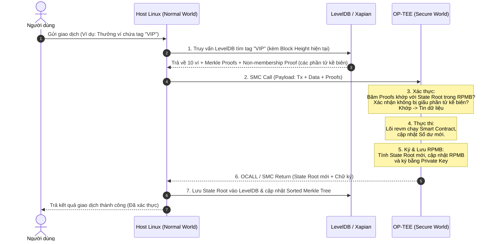

# Tài Liệu Kiến Trúc Tổng Thể: Metanode OP-TEE (Dành Riêng Cho Phần Cứng Yếu)

Tài liệu này trình bày toàn bộ kiến trúc hoàn thiện của Metanode, **được thiết kế ĐỘC QUYỀN và BẮT BUỘC dành riêng cho thiết bị phần cứng yếu giá rẻ (như Orange Pi) chạy OP-TEE (TrustZone)**. Việc sử dụng OP-TEE trên các thiết bị này tạo ra những giới hạn vật lý cực kỳ khắc nghiệt, buộc hệ thống phải áp dụng những giải pháp thiết kế "hy sinh" để tích hợp được TEE với các công cụ khổng lồ như Xapian.

> [!NOTE]
> Tài liệu này đóng vai trò là "Sự thật tối cao" (Source of Truth) cho việc thiết kế, xây dựng và tích hợp hệ thống thực thi bảo mật trên chuỗi khối phụ của Metanode.

---

## 1. Triết Lý Kiến Trúc Lõi: "Chia Cắt Thế Giới" (Vì OP-TEE phần cứng quá yếu)

Toàn bộ sự phức tạp của kiến trúc này xuất phát từ một nút thắt vật lý duy nhất:

> [!IMPORTANT]
> **Giới Hạn Vật Lý Khắc Nghiệt:**
> Secure RAM của TrustZone trên Orange Pi chỉ có vỏn vẹn **~16MB đến 32MB** và hoàn toàn không có ổ cứng vật lý để lưu trữ dữ liệu.
> Nếu chạy trên Server doanh nghiệp (như Intel SGX) với hàng trăm GB RAM, ta có thể nhét toàn bộ Node vào TEE. Nhưng với OP-TEE trên phần cứng yếu, ta **BẮT BUỘC** phải chia hệ thống thành 2 nửa hoàn toàn biệt lập:
*   **Normal World (Host Linux không tin cậy):** Đảm nhiệm các tác vụ **ĐỌC (Read), LƯU TRỮ (Storage) và TÌM KIẾM (Search)**. Môi trường này có tài nguyên vô hạn (RAM, Ổ cứng, Network) nhưng hoàn toàn không được tin tưởng.
*   **Secure World (OP-TEE tin cậy tuyệt đối):** Đảm nhiệm các tác vụ **TÍNH TOÁN & KÝ DUYỆT (Execute & Sign)**. Môi trường này tài nguyên cực kỳ eo hẹp, yếu ớt nhưng giữ vai trò "Quan Tòa", cầm chìa khóa bảo mật sinh sát của mạng lưới (việc ghi dữ liệu bền vững xuống đĩa vẫn do Host đảm nhận).

---

## 2. Quản Lý Trạng Thái & Hệ Thống Tìm Kiếm Xác Thực (Verifiable Search Architecture)

Việc tích hợp một Search Engine khổng lồ bằng C++ như Xapian vào môi trường `no_std` cực kỳ eo hẹp của TEE là **bất khả thi**. Hơn thế nữa, các công cụ tìm kiếm full-text thông thường không sở hữu cấu trúc toán học tự chứng minh (như Merkle Tree), dẫn đến nguy cơ bị Host độc hại che giấu kết quả (Censorship).

Để giải quyết triệt để rào cản này mà không làm ảnh hưởng đến hiệu năng phần cứng yếu (Orange Pi), Metanode thiết kế **Kiến trúc Tìm kiếm Xác thực Lai (Hybrid Verifiable Search Architecture)** dựa trên nguyên lý: **Tách biệt đường đi tiền (Structured Queries) khỏi đường đi tìm kiếm tự do (Unstructured Search)**.

---

### A. Phân Loại Truy Vấn: Đường Đi Tiền vs. Đường Đi Đọc

Hệ thống phân tách rõ ràng mọi yêu cầu dữ liệu thành hai loại có mức độ bảo mật và cơ chế xác thực hoàn toàn khác nhau:

*   **Truy Vấn Có Cấu Trúc (Structured Queries - Đường đi tiền):**
    *   **Mô tả:** Các truy vấn có cấu trúc rõ ràng, đoán trước được hình dạng (ví dụ: truy vấn danh sách theo thẻ tag sự kiện, theo địa chỉ ví, khoảng giá trị, bộ đếm số lần giao dịch).
    *   **Vai trò:** Đây là loại dữ liệu **duy nhất** được phép dùng làm đầu vào để kích hoạt các logic Smart Contract làm thay đổi trạng thái (như chuyển tiền, thưởng token).
    *   **Yêu cầu:** Xác thực toán học tuyệt đối (100% Trustless). TEE tự kiểm chứng được tính toàn vẹn và **tính đầy đủ** của dữ liệu mà không cần tin tưởng Host hay Swarm bên ngoài.
*   **Tìm Kiếm Tự Do (Unstructured Search - Đường đi đọc/UX):**
    *   **Mô tả:** Các truy vấn full-text, tìm kiếm mờ ngữ nghĩa (ví dụ: quét chuỗi văn bản tự do trong Memo của block).
    *   **Vai trò:** Chỉ phục vụ cho mục đích đọc, hiển thị giao diện (Explorer, UI), không bao giờ được phép trực tiếp thay đổi số dư tài khoản.
    *   **Yêu cầu:** Cho phép độ trễ và áp dụng mô hình an toàn lạc quan (Optimistic) thay vì toán học trực tiếp.

---

### B. Structured Query: Sử Dụng Sorted/Namespaced Merkle Tree để Sinh Bằng Chứng Phi Thành Viên (Non-membership Proof)

Lập luận "thảm họa độ trễ ghi khi xây dựng Merkle cho Search" chỉ đúng khi ta token hóa toàn bộ văn bản để lập chỉ mục. Trong Metanode, đối với các truy vấn structured:

1.  **Ràng buộc số lượng thẻ (Tag Bound):** Mỗi giao dịch chỉ được phép đính kèm tối đa $K$ thẻ có cấu trúc hữu hạn (ví dụ: $K \le 5$, gồm người gửi, người nhận, loại sự kiện, và 1-2 tag do dApp đăng ký trước). Số lượng tag cực nhỏ giúp chi phí ghi chỉ là $K \times O(\log N)$ phép băm — hoàn toàn khả thi trên CPU yếu của Orange Pi.
2.  **Cấu trúc Sorted Merkle Tree:** Các bản ghi trên lá của cây Merkle được sắp xếp tăng dần theo khóa phân cấp `(tag, key)`. 
3.  **Non-membership Proof (Bằng chứng phi thành viên):** 
    *   Khi Host trả về kết quả tìm kiếm (ví dụ: 10 ví có tag "VIP"), Host bắt buộc phải gửi kèm các **Merkle Proof của các phần tử kề biên** nằm ngay trước và ngay sau danh sách kết quả đó.
    *   Bằng cách đối chiếu các phần tử kề biên này, TEE (Quan Tòa) có thể tự chứng minh bằng toán học rằng: *Giữa phần tử đầu tiên và phần tử cuối cùng được trả về, hoàn toàn không còn bất kỳ phần tử nào khác khớp với tag "VIP" bị Host giấu đi*.
    *   **Kết quả:** TEE tự xác thực tính đầy đủ của kết quả tìm kiếm bằng toán học thuần túy, không cần hỏi ý kiến Swarm, loại bỏ hoàn toàn rủi ro Sybil.

---

### C. Unstructured Search: Cơ Chế Lạc Quan (Optimistic Fraud-Proof) & VRF Committee

Đối với tìm kiếm full-text tự do (nơi cấu trúc toán học Merkle Tree không thể áp dụng hoặc quá đắt đỏ), Metanode loại bỏ mô hình biểu quyết đa số 2f+1 lửng lơ để chuyển sang mô hình **An toàn 1-trong-N trung thực (Optimistic Fraud-Proof)**:

1.  **Chấp nhận Lạc quan (Optimistic Execution):** TEE chấp nhận kết quả tìm kiếm do Host nộp lên ngay lập tức để xử lý nhanh và tạm chốt trạng thái.
2.  **Cửa sổ Thử thách (Challenge Window):** Trạng thái tạm chốt sẽ được giữ lại trong một khoảng thời gian thử thách. Trong thời gian này, bất kỳ một node nào trong mạng (chỉ cần **1 node trung thực duy nhất**) phát hiện ra Host cung cấp thiếu dữ liệu, có thể gửi một **Fraud Proof** (bằng chứng gồm bản ghi bị bỏ sót kèm Merkle Proof chứng minh nó đã tồn tại hợp lệ).
3.  **Trừng phạt (Slashing):** Nếu Challenge hợp lệ, Host gian lận sẽ bị slashing toàn bộ số tiền cọc (bonding) đã stake, kết quả tạm chốt bị hủy bỏ. Thiết kế này mạnh hơn biểu quyết đa số rất nhiều, vì kẻ tấn công muốn gian lận phải kiểm soát toàn bộ 100% các node trong mạng để không ai challenge, thay vì chỉ cần kiểm soát 67% như mô hình cũ.
4.  **Lấy mẫu ủy ban ngẫu nhiên (VRF Committee Sampling):** Để không phải phát sóng (broadcast) yêu cầu challenge đến toàn bộ mạng lưới gây nghẽn băng thông, hệ thống sử dụng hàm **VRF (Verifiable Random Function)** để chọn ngẫu nhiên một ủy ban nhỏ các Validator làm nhiệm vụ giám sát thử thách cho từng truy vấn, tối ưu hóa băng thông mạng.

---

### D. Giải quyết tính nhất quán Dual-DB (Atomic & Eventual Consistency)

Do Xapian (Search Engine) và LevelDB (Kho chứa sự thật) là hai cơ sở dữ liệu hoạt động độc lập, việc cập nhật đồng thời cả hai không thể thực hiện qua một giao dịch cơ sở dữ liệu nguyên tử (atomic transaction) duy nhất. Nếu máy Host bị crash đột ngột giữa chừng hoặc Xapian bị trễ index, sự không nhất quán (State Drift) sẽ xảy ra.

Để ngăn ngừa trường hợp Xapian index trễ dẫn đến việc sinh Fraud Proof sai lệch hoặc đối chiếu chéo bị lệch, hệ thống áp dụng cơ chế **State-Versioned Query (Truy vấn theo phiên bản trạng thái)**:
1.  **Gắn nhãn phiên bản (Block Height Labeling):** Mọi tài liệu và chỉ mục được ghi vào Xapian đều được gắn kèm số hiệu phiên bản block (`block_height`).
2.  **Truy vấn có chỉ định phiên bản:** Khi thực hiện tìm kiếm, TEE hoặc Smart Contract bắt buộc Host phải gửi kèm tham số `block_height` muốn truy vấn. Xapian trên Host chỉ lọc ra các kết quả có `block_height` nhỏ hơn hoặc bằng tham số yêu cầu.
3.  **Xử lý trễ Index (Lag Grace Period):** Node đang bị trễ index (chưa cập nhật tới `block_height` yêu cầu) sẽ trả về mã trạng thái `Pending/IndexLag` kèm chiều cao hiện tại của nó để tiếp tục đồng bộ cho đến khi bắt kịp, tránh bị phạt slashing oan do độ trễ kỹ thuật.

---

### E. Giải đáp: Có lãng phí ổ cứng khi dùng 2 DB? Tại sao không dùng "Bầy đàn" thay luôn cho Merkle Proof?

Nhiều người tinh ý sẽ nhận ra: *"Việc lưu song song cả Xapian và LevelDB gây tốn gấp đôi ổ cứng. Vậy tại sao không bỏ luôn LevelDB (Merkle Proof đi), cứ để Xapian tìm xong rồi dùng Swarm đối chiếu chéo?"*

Sự kết hợp này là bắt buộc vì:
1. **Sự đánh đổi ổ cứng (Storage Trade-off):** Ổ cứng là tài nguyên rẻ mạt nhất. Sử dụng nó để lưu trữ kép đổi lại khả năng bảo vệ TEE (chỉ 16MB RAM) là thiết kế tối ưu nhất.
2. **Toán học là chân lý tối thượng:** Sự bảo vệ của toán học (Merkle Proof) độc lập với số lượng node bị tấn công. Ngay cả khi hacker chiếm được 99% số node, chúng cũng không thể bịa đặt ra một Merkle Proof hợp lệ khớp với State Root mà TEE đang giữ. Biểu quyết đám đông (Consensus) chỉ được dùng lạc quan cho luồng Unstructured Search và được bảo vệ bằng cơ chế challenge "1-trong-N trung thực" chứ không dùng cho luồng chuyển tiền cốt lõi.

---

### F. Giải mã: Tại sao các Search Engine khác không có Merkle Proof?

Việc thiếu vắng Merkle Proof trong các Search Engine lớn (Elasticsearch, Lucene, Meilisearch) là do xung đột toán học cốt lõi:
1. **Inverted Index:** Token hóa 1 tài liệu thành hàng ngàn posting lists độc lập.
2. **Merkle Tree:** Yêu cầu băm lại toàn bộ nhánh khi có thay đổi.
👉 Nếu tích hợp trực tiếp, mỗi lần ghi 1 từ khóa mới sẽ kích hoạt hàng ngàn phép băm Merkle, làm độ trễ ghi (Write Latency) giảm đi hàng trăm lần.
Do đó, Metanode chọn cách thiết kế khôn ngoan nhất: **Không cố xây dựng một Merkle-Xapian**. Thay vào đó, chúng ta giới hạn số lượng tag cấu trúc trên **Sorted Merkle Tree** riêng biệt cho luồng xử lý tiền, và để Xapian thuần túy chạy độc lập ở ngoài Host phục vụ cho luồng đọc/UI lạc quan.

---

### G. Cơ chế chống tấn công Rollback/Replay (State Rollback Protection)

Do TEE là môi trường phi trạng thái (stateless) giữa các lần gọi (RAM bị xóa sạch sau khi thực thi và trả kết quả để đảm bảo an toàn), hệ thống phải đối mặt với nguy cơ tấn công **Rollback/Replay**. 

*   **Kịch bản tấn công:** Một Host Linux độc hại có thể lưu trữ bản snapshot cũ của LevelDB (ở block height cũ), sau đó gửi State Root cũ này kèm Merkle Proof hợp lệ tại thời điểm đó để yêu cầu TEE ký duyệt giao dịch mới. TEE nếu "mù" hoàn toàn về lịch sử sẽ không thể tự phát hiện ra vì chữ ký và Merkle Proof cũ vẫn khớp hoàn hảo về mặt toán học.
*   **Giải pháp bảo vệ bằng Trusted Storage (RPMB):**
    1.  **Phần cứng lưu trữ an toàn:** OP-TEE hỗ trợ **Trusted Storage API**, được backed trực tiếp bởi phân vùng **RPMB (Replay Protected Memory Block)** trên bộ nhớ eMMC của thiết bị Orange Pi. RPMB sử dụng khóa chia sẻ (shared key) được ghi vào phần cứng trong quá trình sản xuất, giúp chống lại mọi hình thức đọc/ghi trái phép và replay từ phía Host (Normal World).
    2.  **Lưu giữ trạng thái tối cao (State Anchor):** TA (Trusted Application) chạy trong Secure World sẽ tự ghi nhận và cập nhật cặp thông tin trạng thái tối cao bao gồm: `(latest_state_root, monotonic_counter)` (hoặc `latest_block_height`) vào Trusted Storage sau mỗi lần thực thi thành công.
    3.  **Xác thực nghiêm ngặt:** Khi nhận SMC call yêu cầu thực thi giao dịch, TEE bắt buộc Host phải cung cấp State Root hiện tại. TEE sẽ đọc `latest_state_root` từ RPMB và đối chiếu:
        *   Nếu State Root do Host gửi lên không khớp với `latest_state_root` được lưu trong RPMB (hoặc block height không tăng đơn điệu một cách hợp lệ), TEE sẽ từ chối thẳng thừng và không ký duyệt.
        *   Nếu khớp, TEE thực thi logic, tính toán ra State Root mới, ghi đè State Root mới vào RPMB, tăng monotonic counter, rồi mới thực hiện ký bằng Private Key nội bộ.
    4.  **Kết quả:** Nhờ cơ chế RPMB, TEE tự biến mình thành "nguồn chân lý" duy nhất giữ trạng thái mới nhất của chuỗi khối phụ, loại bỏ hoàn toàn khả năng bị đánh lừa bởi các snapshot cũ từ phía Host.

---

## 3. Cách Thức Chạy Smart Contract (MVM) Trong TEE

Việc chạy Node EVM nguyên bản (như Geth) trong TEE cũng là bất khả thi. Thay vào đó, ta sử dụng **Kiến trúc Stateless Micro-EVM**.

### A. Lõi Micro-EVM
*   Metanode biên dịch lõi **`revm`** (viết bằng Rust) với cấu hình `no_std` (loại bỏ hệ điều hành).
*   Sử dụng **Apache Teaclave TrustZone SDK** để đóng gói lõi này thành một Trusted Application (TA) nằm sâu trong TrustZone của Orange Pi. Dung lượng lõi được thiết lập mục tiêu chỉ chiếm vài Megabyte RAM (cần benchmark cụ thể đối với các thư viện precompile mật mã để đảm bảo vừa khít trong Secure RAM).

### B. Luồng Xử Lý Giao Dịch Tích Hợp Xapian & Sorted Merkle Tree (Structured Query - Đường đi tiền)

Giả sử có một Smart Contract thực thi lệnh: *"Thưởng token cho 10 ví có lịch sử giao dịch chứa tag 'VIP'"*. Đây là một giao dịch bắt buộc phải có hệ thống tìm kiếm xác thực structured để thực thi chuyển tiền.

1.  **Tiền xử lý & Trích xuất bằng chứng (Host chọc DB):** Máy Host (Linux) nhận giao dịch từ User. Host truy vấn LevelDB để trích xuất danh sách 10 ví có tag "VIP" kèm theo các **Merkle Proofs** và **Non-membership Proof** (bằng chứng kề biên chứng minh không còn ví VIP nào khác).
2.  **Đóng gói & ECALL (Đưa vào TEE):** Host gom tất cả thành một Payload duy nhất: `[Lệnh giao dịch] + [Data 10 ví] + [Merkle & Non-membership Proofs]` rồi gọi cổng SMC gửi vào cho vùng an toàn TrustZone.
3.  **TEE Xác Thực (Verify):** Lõi `revm` bên trong TEE đọc `latest_state_root` từ RPMB, kiểm tra tính hợp lệ của Merkle Proofs và Non-membership Proof. Nếu khớp 100%, TEE hoàn toàn tin tưởng dữ liệu đầu vào là chính xác và đầy đủ mà không cần tin Host.
4.  **Thực thi & Ký (Execute & Sign):** `revm` chạy logic Smart Contract để cộng tiền. TEE tính ra State Root mới, ghi đè State Root mới vào RPMB, và dùng Private Key nội bộ ký xác nhận.
5.  **Cập nhật trạng thái:** TEE ném State Root mới và chữ ký ra ngoài cho Host thông qua cổng ra (SMC Return). Host nhận dữ liệu, ghi đè vào LevelDB và đồng bộ hóa các chỉ mục tương ứng.

---

## 4. Đánh Giá Rủi Ro An Toàn (Safety Risk Assessment)

Dù TEE là vòng bảo vệ vững chắc, nhưng nó không hoàn hảo. Dưới đây là các rủi ro phần cứng và cách kiến trúc Metanode vô hiệu hóa chúng:

### Rủi ro 1: Trích xuất khóa bằng phần cứng (Physical Decapping / Side-channel)

> [!WARNING]
> **Tình huống:** Hacker mang máy Orange Pi vào phòng lab, "bóc vỏ chip" để đọc lén điện áp, hoặc dùng lỗ hổng Side-channel (như Spectre) để đánh cắp Private Key giấu trong TEE. Nếu có Key, hacker có thể tự tạo State Root giả.
>
> **Giải pháp vô hiệu hóa:** Áp dụng **Orange Swarm (Chữ ký ngưỡng BLS)**.
> *   Mạng lưới không bao giờ giao toàn bộ quyền lực cho 1 máy Orange Pi. Private Key được chia nhỏ (Shamir's Secret Sharing - Chia sẻ bí mật Shamir) cho 1.000 máy.
> *   Hợp đồng trên Public Chain yêu cầu phải có chữ ký gộp (Aggregated Signature) của ít nhất **667/1.000 máy**.
> *   **Kết luận:** Hacker không thể hack vật lý hàng trăm máy Orange Pi nằm rải rác khắp nơi cùng một lúc. Mạng lưới miễn nhiễm với lỗ hổng vật lý cục bộ.

### Rủi ro 2: Lỗi phần mềm bên trong TEE (Enclave Software Bug)

> [!WARNING]
> **Tình huống:** Mã nguồn của lõi `revm` hoặc mã chuyển đổi ECALL/OCALL bị lỗi tràn bộ đệm (Buffer Overflow), dẫn đến việc tính toán sai kết quả nhưng TEE vẫn ký xác nhận.
>
> **Giải pháp vô hiệu hóa:** 
> *   Sử dụng ngôn ngữ **Rust** (Ngôn ngữ an toàn bộ nhớ tuyệt đối) thay vì C/C++. Các lỗi tràn RAM bị triệt tiêu từ cấp độ trình biên dịch.
> *   Sử dụng lõi `revm` đã được cộng đồng Ethereum thế giới Audit (kiểm toán) gắt gao.

### Rủi ro 3: Public Chain bị lừa bởi thiết bị giả lập (Emulator Spoofing)

> [!WARNING]
> **Tình huống:** Hacker không dùng Orange Pi thật mà dùng phần mềm giả lập (QEMU) tạo ra một môi trường OP-TEE ảo nhằm mục đích trích xuất hoặc tự sinh chữ ký giả mạo. Ngoài ra, chip giá rẻ (như Allwinner, Rockchip...) thường không có một dịch vụ Remote Attestation tập trung do ARM/nhà sản xuất SoC vận hành để kiểm chứng chữ ký phần cứng an toàn như Intel SGX.
>
> **Giải pháp vô hiệu hóa:** **Thiết kế phòng thủ chiều sâu (Defense-in-depth) kết hợp an ninh kinh tế.**
> *   **Remote Attestation là lớp phòng thủ phụ:** Sử dụng cơ chế Remote Attestation để kiểm tra các thông số đo lường (measurements) của TA và Enclave. Tuy nhiên, hệ thống không đặt cược toàn bộ an ninh vào attestation phần cứng ở phân khúc giá rẻ này.
> *   **An ninh kinh tế (Economic Security / Bonding) là lớp phòng thủ chính:** Mỗi node tham gia mạng lưới bắt buộc phải ký gửi một khoản tiền cọc lớn (Bonding/Staking) gắn liền với danh tính thực.
> *   **Giả định TEE có thể bị thỏa hiệp:** Hệ thống vận hành trên giả định rằng bất kỳ một TEE đơn lẻ nào cũng có thể bị hack hoặc giả lập thành công. Nhờ có cơ chế đồng thuận chữ ký ngưỡng (BLS Threshold Signature 667/1000), hacker dù có giả lập thành công một vài node TEE vẫn không thể gây hại cho hệ thống vì không thể tích lũy đủ 2f+1 (~67%) tổng số cọc của mạng lưới để tạo ra chữ ký gộp hợp lệ. Nếu phát hiện bất kỳ node nào có chữ ký sai lệch, hệ thống sẽ tự động slashing tiền cọc của node đó.

---

## 5. Đánh Giá Hiệu Năng & Tốc Độ (Performance & Speed)

Một câu hỏi lớn đặt ra là: *"Phần cứng yếu như Orange Pi, cộng thêm việc phải chui ra chui vào TEE liên tục, thì tốc độ của Private Chain có rùa bò không?"*

Thực tế, tốc độ của kiến trúc này mang đặc tính: **Độ trễ (Latency) trung bình, nhưng Băng thông (Throughput/TPS) khổng lồ**.

### A. Nhược điểm (Những điểm gây nghẽn tốc độ / Độ trễ cao)
1.  **Độ trễ chuyển đổi ngữ cảnh (World Switch Latency):** Việc gửi Payload từ Linux Host đi qua cổng SMC vào TrustZone yêu cầu CPU phải đóng băng HĐH, lưu lại thanh ghi và chuyển đổi môi trường. Quá trình này cực kỳ đắt đỏ về mặt thời gian (mất vài mili-giây).
    *   *Cách khắc phục:* Không gửi từng byte lắt nhắt. Kiến trúc bắt buộc Host phải gom tất cả (Giao dịch + Data + Proofs) thành một cục Payload duy nhất rồi mới gọi SMC 1 lần cho 1 block/batch giao dịch.
2.  **Gánh nặng mã hóa (Cryptography Overhead):** Lõi Cortex-A53/A55 trên Orange Pi không mạnh. Việc bắt nó phải liên tục băm (Hash) hàng loạt Merkle Proofs và tính toán chữ ký BLS sẽ tiêu tốn CPU.
3.  **Độ trễ mạng Bầy đàn (Swarm Network Latency):** Việc chờ hàng trăm máy Orange Pi ở các khu vực địa lý khác nhau cùng tính toán và gửi chữ ký về để cộng gộp (BLS Aggregation) sẽ bị độ trễ vật lý của mạng Internet. Giao dịch sẽ mất khoảng vài giây để chốt hạ (Finality).

### B. Ưu điểm tuyệt đối (Sức mạnh Băng thông - High TPS)
1.  **Xử lý Song song vô cực (Horizontal Scaling):** Mạng lưới không bắt 1 máy tính phải xếp hàng chạy toàn bộ giao dịch của cả thế giới (như Ethereum). Nhờ **Phân mảnh hợp đồng (Contract-Level Sharding)**, nếu mạng có 10.000 máy Orange Pi, chúng có thể xử lý 10.000 Smart Contract *hoàn toàn song song độc lập* cùng một lúc. TPS (Số giao dịch / giây) của toàn mạng lưới có mục tiêu lý thuyết mở rộng lên tới hàng chục nghìn.
    *   *Thách thức về giao dịch liên Shard (Cross-shard composability):* Sharding theo hợp đồng mang lại hiệu năng cao nhưng lại gặp bài toán hóc búa về khả năng tương tác nguyên tử (atomic composability) giữa các hợp đồng nằm ở các shard khác nhau (ví dụ: một giao dịch swap token yêu cầu gọi đồng thời pool thanh khoản ở Shard A và tài khoản ví ở Shard B). Thay vì sử dụng **Two-Phase Commit (2PC)** đồng bộ gây khóa chặt (locking) và làm giảm hiệu năng, Metanode áp dụng cơ chế **Giao tiếp liên Shard bất đồng bộ (Asynchronous Message Passing)** thông qua các "Ticket" được ký xác thực bởi TEE, giúp loại bỏ hoàn toàn độ trễ chờ đợi giữa các Shard.
2.  **Tốc độ thực thi TEE (Bare-metal speed):** Một khi Payload đã vượt qua cổng SMC và nằm gọn trong TEE, lõi `revm` viết bằng Rust chạy ở chế độ `no_std` (không vướng víu rác của hệ điều hành) sẽ chạy logic Smart Contract với tốc độ bàn thờ (gần với tốc độ nguyên thủy của chip).

### C. Phân Loại Tốc Độ Theo Từng Loại Giao Dịch

Do đặc thù kiến trúc "lắp ghép" nhiều mảnh (Host, TEE, LevelDB, Xapian), tốc độ xử lý sẽ thay đổi chóng mặt tùy thuộc vào độ phức tạp của giao dịch. Ta có thể chia thành 3 phân khúc:

1.  **Giao dịch Native Coin (Chuyển tiền cơ bản): ⚡ Nhanh Nhất**
    *   **Đặc điểm:** Chỉ cần cộng/trừ số dư gốc (ví dụ MET token) giữa 2 ví. Không cần chạy máy ảo `revm`, không cần hỏi Xapian.
    *   **Độ trễ:** Rất thấp. Host chỉ việc lấy 2 cái Merkle Proof từ LevelDB ném vào TEE. TEE thực hiện phép cộng trừ đơn giản rồi ký ngay lập tức.
    *   **Đánh giá:** Đạt hiệu năng tối đa của hệ thống.
2.  **Giao dịch Smart Contract Thường (AMM Swap, ERC20): 🚀 Nhanh**
    *   **Đặc điểm:** Chạy logic phức tạp nhưng **đã biết trước đích đến**. Ví dụ: Swap token A sang B, ta biết chính xác cần móc dữ liệu từ Pool A-B. Không cần tìm kiếm Xapian.
    *   **Độ trễ:** Thấp. Host móc dữ liệu Pool từ LevelDB ném vào TEE. TEE mất thêm một chút thời gian để khởi động lõi `revm` chạy bytecode của Smart Contract.
    *   **Đánh giá:** Rất mượt mà, gánh được toàn bộ các ứng dụng DeFi phổ thông hiện nay.
3.  **Giao dịch Smart Contract + Xapian (Truy vấn dữ liệu lớn): 🐢 Chậm Nhất**
    *   **Đặc điểm:** Lệnh yêu cầu phải quét lịch sử hoặc tìm kiếm Full-text (Ví dụ: *"Airdrop cho ai có chữ VIP trong Memo"*).
    *   **Độ trễ:** Cao nhất. Phải trải qua quy trình dài: Host hỏi Xapian -> Xapian quét Index -> Host lấy Keys chọc LevelDB -> Rút Data + nhiều Merkle Proofs -> Đóng gói khổng lồ ném vào TEE -> TEE è cổ ra băm hàng loạt Merkle Proofs trước khi chạy `revm`.
    *   **Đánh giá:** Giao dịch loại này sẽ bị thắt cổ chai ở khâu băm Merkle Proof bên trong TEE (do CPU Orange Pi yếu). Mặc dù chậm, nhưng nó cho phép Metanode chạy được những Smart Contract siêu việt (có tính năng Search) mà Ethereum không bao giờ làm được.

**Kết luận về tốc độ & Kế hoạch Thực nghiệm (Benchmark Plan):** 
Nếu bạn kỳ vọng 1 giao dịch bấm nút xong hoàn thành ngay lập tức trong 0.1 giây thì kiến trúc này không làm được (vì rào cản vật lý SMC và mạng P2P). 

Con số "hàng chục nghìn TPS" nêu trên hiện tại là **mục tiêu lý thuyết**. Trong thực tế, để đạt được và kiểm chứng năng lực vận hành, Metanode cần triển khai kế hoạch thực nghiệm (benchmark) nghiêm ngặt trên phần cứng Orange Pi thật, bao gồm:
1.  Đo đạc độ trễ SMC round-trip (chuyển ngữ cảnh Normal-Secure World).
2.  Đo tốc độ băm Merkle Proof và xác thực chữ ký (BLS/secp256k1) bên trong TEE với cấu hình RAM/CPU thực tế.
3.  Đo tốc độ ghi LevelDB và index Xapian trên môi trường đĩa cứng của Orange Pi.
4.  Thử nghiệm hiệu năng của các giao dịch liên shard (Cross-shard Transactions) để đo mức độ suy giảm TPS.

Tuy nhiên, nếu xét trên bình diện **Tổng lực (Băng thông TPS)**, kiến trúc bầy đàn này là vô địch. Nó có thể gánh hàng vạn giao dịch mỗi giây nhờ khả năng rải đều công việc cho hàng vạn máy giá rẻ, dẹp bỏ hoàn toàn điểm nghẽn cổ chai của các mạng lưới nguyên khối (Monolithic) hiện nay.

---

## 6. Tối Ưu Hóa Hệ Thống Cho Phần Cứng 16MB (System Optimizations)

Để kiến trúc "Chia cắt thế giới" thực sự vận hành mượt mà trên giới hạn 16MB Secure RAM của Orange Pi, Metanode áp dụng các cơ chế tối ưu hóa sâu dưới đây:

### A. Merkle Mountain Range (MMR) thay thế Binary Merkle Tree
Để tránh việc reconstruct lại cây Merkle lớn gây tốn CPU và tránh vượt quá RAM khi truyền nhiều Proofs, Metanode sử dụng Sorted Merkle Mountain Range (MMR). MMR cho phép phép băm appended với độ phức tạp $O(1)$, và đặc biệt hỗ trợ Range Proof (Bằng chứng dải liên tiếp). Thay vì gửi hàng nghìn Merkle Proofs cho một danh sách kết quả Structured Query, Host chỉ gửi duy nhất một Range Proof nhỏ gọn, giúp TEE xác minh hàng nghìn bản ghi chỉ với vài KB RAM.

### B. Epoch Batching & Đóng Gói Đầy RAM (SMC Batching)
Do chi phí chuyển đổi ngữ cảnh (SMC Call) giữa Normal World và Secure World rất cao (~vài ms/lần), TEE tuyệt đối không xử lý giao dịch đơn lẻ. Hệ thống chia thời gian thành các "Epoch" (ví dụ: 1 giây/Epoch). Host gom (batch) các giao dịch từ Mempool sao cho dung lượng Payload + Proofs xấp xỉ giới hạn 12MB (để chừa 4MB cho stack và runtime của revm). TEE nhận một cục dữ liệu, thực thi hàng loạt, tính 1 State Root cuối cùng, ký 1 lần và trả về. Cơ chế này đánh đổi độ trễ (1s/block) để đổi lấy TPS tối đa.

### C. WAL Fallback Khi Xapian Bị Trễ Index
Để chống lại hiện tượng Pending/IndexLag làm gián đoạn Smart Contract, Host được lập trình cơ chế tự phục hồi: Khi Xapian báo chưa index kịp Block Height yêu cầu, Host sẽ tự động fallback sang phương thức Prefix Scan trực tiếp trên LevelDB để trích xuất dữ liệu Structured. Mặc dù chậm hơn đọc RAM của Xapian, nhưng nó đảm bảo tính Available 100%, không để node bị phạt oan hay bị treo giao dịch.

### D. Giao Tiếp Liên Shard Bất Đồng Bộ (Async Cross-Shard)
Thay vì sử dụng Two-Phase Commit (2PC) đồng bộ gây khóa chặt (locking) và làm sụp đổ hiệu năng Sharding, Metanode áp dụng Asynchronous Message Passing có chứng thực TEE. Các trạng thái chuyển đổi tài sản cross-shard được đóng gói thành "Ticket" được ký duyệt bởi TEE của Shard gốc. Shard đích nhận Ticket, xác minh chữ ký BLS/Secp256k1 của TEE gốc một cách trustless và áp dụng trạng thái. Cơ chế này loại bỏ hoàn toàn độ trễ chờ đợi lock giữa các Orange Pi.

### E. Token Hóa Xác Định Trước (Pre-committed Deterministic Tokenization)
Để Fraud Proof cho tìm kiếm Full-text (Unstructured Search) có thể thực thi được bằng toán học, khi một tài liệu được ghi vào LevelDB, Host bắt buộc phải chạy một hàm băm tokenize xác định (chia chuỗi và băm từng từ) rồi ghi danh sách hash này vào một Keyword-MMR riêng biệt. Khi cần chứng minh Host gian lận bỏ sót kết quả, node trung thực chỉ cần gửi hash của từ khóa tìm kiếm kèm theo Merkle Proof của nó trong Keyword-MMR. TEE chỉ cần đối chiếu hash bằng toán học thuần túy, không cần phân tích ngữ nghĩa, đảm bảo tính chính xác và an toàn tuyệt đối.

---

**Tổng Kết Lại:** Bằng việc đẩy các tác vụ nặng (Xapian, Full DB) ra ngoài Host và chỉ giữ lại lõi Micro-EVM tính toán Stateless bên trong TEE (Execute & Sign), kết hợp với sức mạnh bầy đàn (BLS Threshold), Metanode đã tạo ra một kiến trúc bất khả chiến bại, kể cả khi chạy trên phần cứng rẻ tiền nhất.
