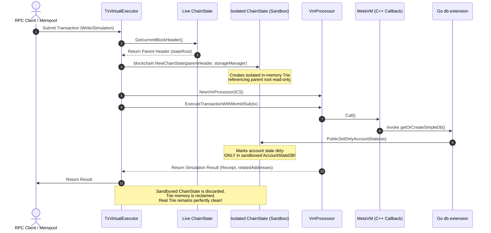

# Metanode Transaction State Isolation Architecture

This document describes the architectural framework implemented to guarantee that virtual transaction verification (mempool dry-run), cross-chain inbound target simulations, and debug RPC executions (`eth_call`, `estimateGas`) operate within completely isolated database sandboxes. This prevents any state mutations from leaking into the live Merkle Trie, preventing network forks and guaranteeing protocol determinism.

---

## 1. Background & The Contamination Vector

In the Metanode Go execution engine, the validator node drives state changes via the `BlockProcessor` and the active `ChainState` wrapper, which holds a single authoritative `AccountStateDB` instance.

### The Vulnerability

When transactions are submitted to the node:
1. The mempool validator performs **Virtual Execution** (or debug RPC via `ProcessTransactionDebug`) to validate balances, gas estimations, nonces, and collect `relatedAddresses` for sequential processing.
2. In the vulnerable design, these dry-runs instantiated `VmProcessor` using the **live** `v.chainState` reference directly.
3. During execution, if a smart contract calls custom database extension callbacks (e.g., calling `getOrCreateSimpleDb` or `deleteDb` registered under `extension.go`), the Go callback handlers retrieve the active `MVMApi` instance, obtain the bound `AccountStateDB`, and mark the account states as **dirty** using `mvmApi.accountStateDb.PublicSetDirtyAccountState(as)`.
4. Because the live `AccountStateDB` was passed to the MVM instance, these dirty mock states contaminated the validator node's active memory trie cache.
5. Upon sealing the block, the block processor executed the pipeline commit phase, committing **all** dirty states from the live `AccountStateDB` into the actual database and generating a mutated `stateRoot`.
6. Nodes that ran these RPC simulations diverged (e.g., node `m0` showing `bal=0, nonce=0` for test accounts), while validators that did not run those virtual simulations remained clean. This resulted in a **Block Hash Mismatch / State Root Divergence** (e.g. Block #223 mismatch).

```
   [Contamination Flow (Vulnerable)]
   
   Mempool / RPC Tx ──► Virtual Execution ──► VmProcessor
                                                                │ (Uses live chainState)
                                                                ▼
   Active Tri Root ◄── Commit Block ◄── Mark Dirty ◄── PublicSetDirtyAccountState()
```

---

## 2. The Isolation Framework

To achieve a **Zero-Fork Invariant**, we enforce absolute structural database isolation between the live consensus engine's block execution and any form of transaction dry-run, simulation, or read-only/debug query.

### The Isolated State View Pattern

Instead of passing the active `v.chainState` directly to the `VmProcessor`, the virtual executor creates a **Local Sandboxed ChainState** at the exact state root of the parent block:

```
                         [Isolated Sandbox Flow]
   
   Mempool / RPC Tx ──► Virtual Execution
                                │
                                ├─► Fetch currentBlockHeader (Parent Root)
                                ├─► blockchain.NewChainState(isolated clone)
                                │
                                ▼
                           VmProcessor
                                │ (Uses isolated chainStateNew)
                                ▼
                 PublicSetDirtyAccountState()
                                │
                                ▼
                     [Isolated AccountStateDB] (Local)
                                │
                                ▼
                       (Garbage Collected) ──► 0% Live Trie Contamination!
```

### Key Components

1. **State Isolation (`trie.NewStateTrie`)**:
   Under the hood, `blockchain.NewChainState` is invoked. It reads the specific parent block header's `AccountStatesRoot()`, and opens a new read-only `accountStateTrie` view pointing to the same underlying PebbleDB / NOMT storage handles. No physical database copies are created (ensuring near-zero performance overhead), but all state-write boundaries are isolated in memory.
2. **Local Mutex & Cache Boundary (`AccountStateDB` Instance)**:
   The sandboxed `ChainState` initializes a dedicated local `AccountStateDB` instance. Any write operations (`PublicSetDirtyAccountState`, `SetNonce`, `SetBalance`) mark states as dirty *only* in this local instance's `dirtyAccountState` cache.
3. **MVM API Partitioning (`mvm.GetOrCreateMVMApi`)**:
   During VM execution, the API maps are partitioned by a unique `mvmId`. The `GetOrCreateMVMApi` call binds the local sandboxed `AccountStateDB` of the temporary `ChainState` to the simulation context. Go callbacks (`getOrCreateSimpleDb`, `deleteDb`) retrieve this exact isolated database and mutate it safely.
4. **Ephemerality**:
   The temporary `ChainState` and its sandboxed trie structures are entirely local variables inside the simulation function. When the function returns, the references are dropped, and all temporary mock state modifications are garbage collected without ever touching the main ledger.

---

## 3. Sequence of Operations

The sequence diagram below illustrates the lifecycle of a virtual transaction check:



---

## 4. Specific Module Integration

### A. Mempool Verification (Bypassed)
* **Status**: Bypassed/Defunct. Standard EVM dry-runs for mempool validation have been removed because Block-STM parallel execution dynamically tracks read/write sets, eliminating the need for pre-computed static related addresses lists.

### B. Cross-Chain Target Simulations (`processBatchSubmitVirtual`)
* **Path**: `execution/cmd/simple_chain/processor/transaction_virtual_processor.go`
* **Action**: Inbound targets (`sendMessage` path) require EVM dry-runs to accurately extract `relatedAddresses`. A single sandboxed `ChainState` is constructed using the latest block header and used for all inbound target simulations in the batch.

### C. Debug RPC Calls (`ProcessTransactionDebug`)
* **Path**: `execution/cmd/simple_chain/processor/transaction_processor_offchain.go`
* **Action**: RPC calls targeting historic blocks reconstruct the exact `ChainState` at the queried block's header, sandbox the execution, and return results cleanly.

---

## 5. Non-Functional Benefits

* **Performance**: Because NOMT and PebbleDB handle read-concurrency exceptionally well via state root snapshots, the on-demand creation of `trie.NewStateTrie` does not block active block execution. This allows maintaining highly optimized node throughput (> 900+ tx/s) under intense RPC load.
* **Traceability**: All off-chain simulations run against clean snapshots, ensuring gas estimations and simulation execution results are 100% deterministic and reproducible across multiple debug attempts.
