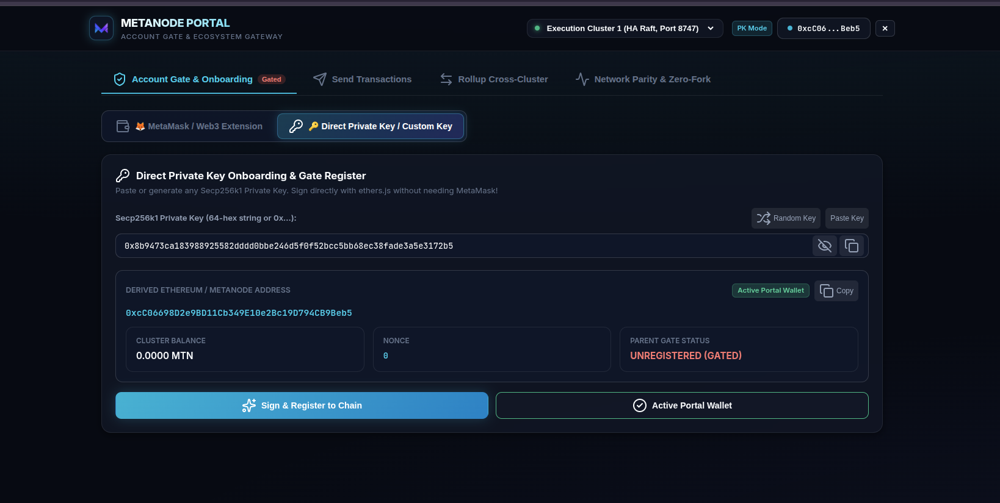
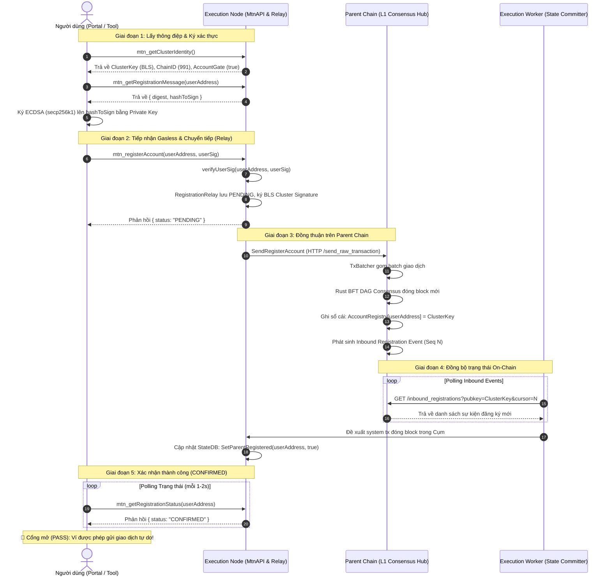

# 📖 HƯỚNG DẪN SỬ DỤNG METANODE PORTAL
*(Account Gate Onboarding, Giao dịch chuyển tiền & Cầu nối Rollup liên cụm)*

---

## 📸 Giao diện thực tế của MetaNode Portal



---

## 🌟 1. Giới thiệu tổng quan

**MetaNode Portal** là ứng dụng Web quản lý tài khoản và tương tác trực tiếp với mạng lưới **MetaNode Core** (gồm **Parent Chain** đồng thuận BFT DAG và các cụm thực thi **Execution Clusters**).

Ứng dụng cung cấp 4 phân hệ chính:
1. **🛡️ Account Gate & Onboarding:** Đăng ký định danh ví người dùng lên Parent Chain để mở quyền giao dịch trên các cụm thực thi.
2. **💸 Send Transactions:** Gửi giao dịch chuyển tiền native token (MTN) nội cụm.
3. **🌉 Rollup Cross-Cluster:** Cầu nối điều phối nạp / rút tiền giữa các Execution Cluster thông qua chứng thực Parent Chain.
4. **📊 Network Parity & Zero-Fork:** Giám sát sức khỏe mạng lưới, chiều cao block (Block Height) và đảm bảo tính bất biến 100% không phân nhánh (Zero-Fork).

---

## 🛡️ 2. Tại sao phải "Đăng ký ví vào Chain" (Parent Chain Account Gate)?

Trong mô hình đa cụm (Multi-Cluster / Sharding) của MetaNode:
- Mỗi cụm thực thi (Execution Cluster) hoạt động độc lập với tốc độ cao.
- Để **chống tấn công phát lại giao dịch (Replay Attack)** xuyên cụm, Parent Chain đóng vai trò làm sổ cái gốc trung tâm (`AccountRegistry`).
- Mỗi địa chỉ ví (`0x...`) khi tham gia vào mạng lưới sẽ được liên kết 1-1 với một Execution Cluster chủ quản.
- **Nếu chưa đăng ký:** Cụm thực thi sẽ chặn mọi giao dịch gửi ra từ ví đó với mã `Code 69: AccountNotRegistered`.
- **Sau khi đăng ký:** Cổng mở (`Gate PASS`), ví được phép gửi giao dịch, chuyển token và deploy Smart Contract tự do.

---

## 🔄 2.1. Chi tiết Luồng Đăng ký Account lên Chain (Technical Architecture Flow)

Luồng đăng ký tài khoản (Account Gate Onboarding) là quy trình phối hợp khép kín giữa **Client** (Portal / Tool), **Execution Cluster** (Node thực thi EVM Shard) và **Parent Chain** (L1 BFT Consensus Hub):

### 📊 Sơ đồ tuần tự các bước (Sequence Flow)



### ⚙️ Chi tiết 5 giai đoạn kỹ thuật:

#### 1️⃣ Giai đoạn 1: Khởi tạo & Tạo chữ ký số (Client-Side)
- Client gọi RPC `mtn_getClusterIdentity` để lấy thông tin cụm (Cluster BLS Public Key, Chain ID 991).
- Client gọi RPC `mtn_getRegistrationMessage(userAddress)`:
  - Node sinh thông điệp đăng ký có cấu trúc: `REGISTER_ACCOUNT_V1:<userAddress><clusterKey>`.
  - Trả về mã băm `hashToSign = keccak256(digest)`.
- Client sử dụng **Private Key của người dùng (ECDSA secp256k1)** để ký lên `hashToSign`:
  - Trong chế độ Private Key / Tool: Dùng `crypto.Sign(hashBytes, privKey)`.
  - Trong chế độ MetaMask: Dùng `personal_sign` thông qua Web3 provider.

#### 2️⃣ Giai đoạn 2: Tiếp nhận Gasless & Chuyển tiếp (Execution Node)
- Client gửi yêu cầu qua RPC `mtn_registerAccount(userAddress, userSignature)`.
  - Toàn bộ bước này là **hoàn toàn miễn phí gas (Gasless)** đối với người dùng.
- Node thực thi (`RegistrationRelay`):
  - Phục hồi public key từ `userSignature` và xác minh tính toàn vẹn đúng là địa chỉ `userAddress`.
  - Kiểm tra xem ví đã từng được đăng ký ở cụm nào khác chưa qua Parent Chain `/account`.
  - Lưu trạng thái đăng ký là `PENDING` vào bộ nhớ và lưu bền vững (Persistent KVStore).
  - Sử dụng **BLS Private Key của cụm** để ký chứng thực lên digest (`clusterSig`).
  - Trả về ngay phản hồi ban đầu `{ status: "PENDING" }` để client chuyển sang cơ chế polling.

#### 3️⃣ Giai đoạn 3: Đồng thuận & Ghi sổ cái trên Parent Chain (L1 BFT Consensus Hub)
- `RegistrationRelay` chuyển tiếp thông tin đăng ký sang Parent Chain qua `parentchain.QuorumClient`:
  - Đóng gói giao dịch hệ thống `pb.Transaction` chứa chữ ký ECDSA người dùng + chữ ký BLS của cụm.
  - Gửi tới Parent Chain Node qua HTTP `POST /send_raw_transaction`.
- Cụm Parent Chain:
  - Tiếp nhận giao dịch vào `TxBatcher`, kiểm tra nonce và tính hợp lệ của chữ ký.
  - Rust BFT DAG Consensus Core đưa giao dịch vào khối DAG mới và thực hiện đồng thuận giữa các validator node (Zero-Fork Invariant).
  - Khi block được chốt (committed):
    - Ghi nhận quyền sở hữu vĩnh viễn: `AccountRegistry[userAddress] = ClusterKey`.
    - Tạo một sự kiện đăng ký trong bảng sự kiện `/inbound_registrations` kèm số thứ tự tuần tự `seq`.

#### 4️⃣ Giai đoạn 4: Đồng bộ trạng thái On-Chain vào Cụm thực thi (Execution Cluster)
- `RegistrationWorker` chạy nền trên node thực thi định kỳ thăm dò Parent Chain qua API:
  `GET /inbound_registrations?pubkey=<ClusterKey>&cursor=<CurrentSeq>`
- Khi phát hiện sự kiện đăng ký cho `userAddress`:
  - Đóng gói thành `AccountRegistrationPayload` (System Payload).
  - Đề xuất giao dịch hệ thống đưa vào block thực thi nội bộ của cụm (qua Raft Consensus).
  - Cập nhật biến trạng thái On-Chain trong StateDB (cây NOMT Trie):
    `SetParentRegistered(userAddress, true)`.

#### 5️⃣ Giai đoạn 5: Xác nhận hoàn tất & Mở cổng Account Gate
- Trong suốt quá trình này, Client định kỳ gọi `mtn_getRegistrationStatus(userAddress)` mỗi 1-2 giây.
- Ngay khi cờ `ParentRegistered = true` được cập nhật trên On-Chain StateDB của cụm (hoặc Parent Chain xác nhận sở hữu):
  - Node phản hồi `{ status: "CONFIRMED" }`.
  - Trên Portal / Tool hiển thị thông báo **`🎉 CONFIRMED (PASS)`**.
  - Từ thời điểm này, bộ lọc `AccountGateTxValidator` sẽ cho phép mọi giao dịch chuyển tiền, gọi smart contract từ địa chỉ ví này đi qua bình thường!

---

## 💻 2.2. Tài liệu Tích hợp API Đăng ký dành cho Client (Client Integration Guide & API Specs)

> 💡 **Dành cho đội ngũ phát triển Client (Frontend / Backend / Bot / Mobile App):**
> Phần này mô tả chính xác những gì **Client cần gửi** và **Chain phản hồi ra sao**, kèm cURL và code mẫu có thể copy-paste chạy được ngay.
> 
> **Đặc điểm nổi bật:**
> - Toàn bộ quy trình onboarding là **Gasless** (Client không cần có sẵn token hay nạp gas trước).
> - Thời gian xác nhận trung bình chỉ mất **1 - 3 giây**.

---

### 📌 Quy trình 3 bước tóm tắt của Client

```
┌────────────────────────┐
│  BƯỚC 1: LẤY HASH KÝ   │  --> Gửi mtn_getRegistrationMessage(userAddress)
└───────────┬────────────┘  <-- Chain trả về digest & hashToSign
            │
┌───────────▼────────────┐
│  BƯỚC 2: TẠO CHỮ KÝ    │  --> Dùng Private Key hoặc MetaMask ký lên hashToSign / digest
└───────────┬────────────┘  <-- Thu được chuỗi chữ ký (signature hex)
            │
┌───────────▼────────────┐
│  BƯỚC 3: GỬI ĐĂNG KÝ   │  --> Gửi mtn_registerAccount(userAddress, signature)
└───────────┬────────────┘  <-- Chain tiếp nhận, trả về { "status": "PENDING" }
            │
┌───────────▼────────────┐
│  POLLING XÁC NHẬN      │  --> Định kỳ gọi mtn_getRegistrationStatus(userAddress) mỗi 1s
└────────────────────────┘  <-- Khi Chain trả về { "status": "CONFIRMED" } => THÀNH CÔNG!
```

---

### 🌐 Thông tin Endpoint kết nối

- **Network Name:** MetaNode Execution Cluster 1
- **JSON-RPC Endpoint:** `http://192.168.1.234:8747` (hoặc `http://127.0.0.1:8747` khi test local)
- **Chain ID:** `991` (Hex: `0x3df`)
- **HTTP Method:** `POST`
- **Header bắt buộc:** `Content-Type: application/json`

---

### 1️⃣ Bước 1: Lấy thông điệp cần ký (`mtn_getRegistrationMessage`)

Trước khi ký, Client cần hỏi Node xem nội dung thông điệp và hash cần ký cho địa chỉ ví này là gì.

#### 📤 Client gửi gì?
- **Method:** `mtn_getRegistrationMessage`
- **Params:** `[ "<USER_ADDRESS>" ]`

**Body JSON-RPC:**
```json
{
  "jsonrpc": "2.0",
  "method": "mtn_getRegistrationMessage",
  "params": ["0x03b49feA5C257230A4f7336288B8a40c6A2b2031"],
  "id": 1
}
```

**Lệnh cURL mẫu:**
```bash
curl -s -X POST http://192.168.1.234:8747 \
  -H "Content-Type: application/json" \
  -d '{
    "jsonrpc": "2.0",
    "method": "mtn_getRegistrationMessage",
    "params": ["0x03b49feA5C257230A4f7336288B8a40c6A2b2031"],
    "id": 1
  }' | jq
```

#### 📥 Chain phản hồi như thế nào?
- **HTTP Status:** `200 OK`
- **Response JSON:**
```json
{
  "jsonrpc": "2.0",
  "id": 1,
  "result": {
    "digest": "REGISTER_ACCOUNT_V1:0x03b49feA5C257230A4f7336288B8a40c6A2b20310x944488b425d29336c7913a3b45946adee6b9bfbd0838c6c8f422f4b4277066f26b3da0530c9f9865e6e534a05ae6c128",
    "hashToSign": "0x5e2b0284482ad4b786312a02b1f09bb994c6f376483568c07d3ae0dcba425fa5"
  }
}
```

**Ý nghĩa các trường trong phản hồi:**
| Trường | Kiểu dữ liệu | Ý nghĩa |
| :--- | :--- | :--- |
| `digest` | string | Chuỗi văn bản nguyên bản kết hợp giữa tag, địa chỉ ví và public key cụm (dùng cho MetaMask `personal_sign`). |
| `hashToSign` | string (32 bytes hex) | Mã băm Keccak-256 của digest (dùng để ký trực tiếp bằng Private Key ECDSA). |

---

### 2️⃣ Bước 2: Client tạo chữ ký số (Sign)

Client chọn 1 trong 2 phương án tùy theo môi trường ứng dụng:

#### 🔹 Phương án A: Dành cho Backend / Bot / Script (Dùng Private Key trực tiếp)
Client dùng Private Key của ví để ký thuật toán **ECDSA secp256k1** lên chuỗi `hashToSign`:

- **Node.js (ethers.js v6):**
  ```javascript
  import { Wallet } from 'ethers';

  const wallet = new Wallet("0x<YOUR_PRIVATE_KEY>");
  // Ký trực tiếp 32-byte hash
  const sig = wallet.signingKey.sign(hashToSign);
  const signatureHex = sig.serialized; // Dạng hex 0x... (65 bytes)
  ```

- **Golang (`github.com/ethereum/go-ethereum/crypto`):**
  ```go
  hashBytes, _ := hexutil.Decode(hashToSign)
  sigBytes, _ := crypto.Sign(hashBytes, privateKey)
  signatureHex := hexutil.Encode(sigBytes) // "0x..."
  ```

#### 🔹 Phương án B: Dành cho Web Frontend (Dùng MetaMask / Web3 Wallet)
Gọi tiện ích MetaMask mở popup yêu cầu người dùng xác nhận ký:

```javascript
const signatureHex = await window.ethereum.request({
  method: 'personal_sign',
  params: [digest, userAddress], // Lưu ý: MetaMask ký lên chuỗi `digest`
});
```

---

### 3️⃣ Bước 3: Gửi yêu cầu đăng ký lên Chain (`mtn_registerAccount`)

Client gửi địa chỉ ví kèm chữ ký vừa tạo lên RPC Node.

#### 📤 Client gửi gì?
- **Method:** `mtn_registerAccount`
- **Params:** `[ "<USER_ADDRESS>", "<SIGNATURE_HEX>" ]`

**Body JSON-RPC:**
```json
{
  "jsonrpc": "2.0",
  "method": "mtn_registerAccount",
  "params": [
    "0x03b49feA5C257230A4f7336288B8a40c6A2b2031",
    "0x7cb51a99d45e5cf6e9e4a839a9c67bc2ee05187e1f4357df8d9bf1eb6ca6a4b16a41f6eefc4a161b1735165d70e4bb334e2c8427fef48ba6d52df15c5e88bb9e1b"
  ],
  "id": 2
}
```

**Lệnh cURL mẫu:**
```bash
curl -s -X POST http://192.168.1.234:8747 \
  -H "Content-Type: application/json" \
  -d '{
    "jsonrpc": "2.0",
    "method": "mtn_registerAccount",
    "params": [
      "0x03b49feA5C257230A4f7336288B8a40c6A2b2031",
      "0x7cb51a99d45e5cf6e9e4a839a9c67bc2ee05187e1f4357df8d9bf1eb6ca6a4b16a41f6eefc4a161b1735165d70e4bb334e2c8427fef48ba6d52df15c5e88bb9e1b"
    ],
    "id": 2
  }' | jq
```

#### 📥 Chain phản hồi như thế nào?

**Trường hợp 1: Tiếp nhận thành công vào hàng đợi (Phổ biến nhất):**
```json
{
  "jsonrpc": "2.0",
  "id": 2,
  "result": {
    "status": "PENDING"
  }
}
```
*(Ý nghĩa: Node đã nhận và bắt đầu chuyển tiếp lên Parent Chain để đồng thuận. Client chuyển sang Bước 4 để thăm dò).*

**Trường hợp 2: Ví đã được đăng ký từ trước:**
```json
{
  "jsonrpc": "2.0",
  "id": 2,
  "result": {
    "status": "CONFIRMED"
  }
}
```
*(Ý nghĩa: Ví này đã được mở cổng sẵn rồi, Client có thể giao dịch ngay mà không cần chờ).*

**Trường hợp 3: Chữ ký không hợp lệ (Lỗi Client):**
```json
{
  "jsonrpc": "2.0",
  "id": 2,
  "error": {
    "code": -32000,
    "message": "signature verification failed: recovered address does not match"
  }
}
```

---

### 4️⃣ Bước 4: Thăm dò trạng thái xác nhận (`mtn_getRegistrationStatus`)

Sau khi nhận được `"status": "PENDING"`, Client thiết lập vòng lặp thăm dò (polling) mỗi **1.0 - 1.5 giây** cho đến khi nhận được `"CONFIRMED"`.

#### 📤 Client gửi gì?
- **Method:** `mtn_getRegistrationStatus`
- **Params:** `[ "<USER_ADDRESS>" ]`

**Body JSON-RPC:**
```json
{
  "jsonrpc": "2.0",
  "method": "mtn_getRegistrationStatus",
  "params": ["0x03b49feA5C257230A4f7336288B8a40c6A2b2031"],
  "id": 3
}
```

**Lệnh cURL mẫu:**
```bash
curl -s -X POST http://192.168.1.234:8747 \
  -H "Content-Type: application/json" \
  -d '{
    "jsonrpc": "2.0",
    "method": "mtn_getRegistrationStatus",
    "params": ["0x03b49feA5C257230A4f7336288B8a40c6A2b2031"],
    "id": 3
  }' | jq
```

#### 📥 Chain phản hồi như thế nào?

**Trường hợp A: Đã hoàn tất thành công (Mở cổng thành công 🎉):**
```json
{
  "jsonrpc": "2.0",
  "id": 3,
  "result": {
    "status": "CONFIRMED"
  }
}
```
> 👉 **Hành động của Client:** Dừng Polling. Ví đã được đăng ký vĩnh viễn trên chain! Có thể gửi tiền, swap token hoặc tương tác smart contract ngay lập tức.

**Trường hợp B: Đang trong quá trình đồng thuận:**
```json
{
  "jsonrpc": "2.0",
  "id": 3,
  "result": {
    "status": "PENDING"
  }
}
```
> 👉 **Hành động của Client:** Tiếp tục chờ và gửi lại request sau 1 giây (thường sau 1-2 lần thăm dò là xong).

**Trường hợp C: Bị từ chối (Ví đã liên kết với cụm khác):**
```json
{
  "jsonrpc": "2.0",
  "id": 3,
  "result": {
    "status": "REJECTED",
    "homeCluster": "0x89ab12...",
    "reason": "account already registered on another cluster"
  }
}
```
> 👉 **Hành động của Client:** Dừng Polling và thông báo người dùng: ví này đã thuộc quyền sở hữu của cụm khác, không thể đăng ký đè.

---
## 🚀 3. Hướng dẫn chi tiết từng chức năng trên Portal UI

### 📍 Phân hệ 1: Account Gate & Onboarding (Đăng ký ví)

Giao diện hỗ trợ **2 chế độ đăng ký linh hoạt**:

```
+---------------------------------------------------------------------------------+
|  [🦊 MetaMask / Web3 Extension]   |   [🔑 Direct Private Key / Custom Key] (Active)  |
+---------------------------------------------------------------------------------+
```

#### 🔹 Lựa chọn A: Dùng Private Key trực tiếp (Khuyên dùng cho Dev & Test)
*(Xem hình ảnh minh họa thực tế bên trên)*

1. **Nhập Private Key:**
   - Dán chuỗi 64 ký tự hex (có hoặc không có tiền tố `0x`) vào ô nhập khóa.
   - Bấm nút **`🎲 Random Key`** nếu bạn muốn Portal tự sinh ngẫu nhiên một cặp khóa mới tinh.
   - Bấm nút **`👁️` (con mắt)** để ẩn hoặc hiện private key; bấm **`📋`** để copy.
2. **Tự động nhận diện Địa chỉ ví (`Derived Address`):**
   - Hệ thống tự động tính toán địa chỉ ví tương ứng dạng `0x...` ngay lập tức.
   - Đồng thời tự động truy vấn thời gian thực:
     - **Cluster Balance:** Số dư MTN trên cụm hiện tại.
     - **Nonce:** Số thứ tự giao dịch (tài khoản mới luôn là `0`).
     - **Parent Gate Status:** Trạng thái đăng ký (`UNREGISTERED (GATED)` nếu chưa đk, hoặc `CONFIRMED (PASS)` nếu đã đk).
3. **Thực hiện Đăng ký lên Chain:**
   - Bấm nút **`✨ Sign & Register to Chain`**.
   - Portal sẽ tự động chạy qua quy trình 4 bước hiển thị trên thanh tiến trình:
     1. `ECDSA Sign`: Dùng Private Key ký trực tiếp mã băm xác thực (`hashToSign`) ngay trên máy bạn.
     2. `Node Relay`: Gửi chữ ký gasless lên node relay thông qua RPC `mtn_registerAccount`.
     3. `Parent Consensus`: Node đóng gói chữ ký BLS của cụm chuyển tiếp lên Parent Chain để đưa vào khối DAG đồng thuận BFT.
     4. `Ready (CONFIRMED)`: Trạng thái đổi thành **`CONFIRMED`**, cổng giao dịch được mở hoàn toàn!
4. **Kích hoạt ví làm việc:**
   - Bấm nút **`🚀 Connect to Portal as Active Wallet`**.
   - Header sẽ hiện nhãn **`PK Mode`** kèm địa chỉ ví vừa kết nối.

---

#### 🔹 Lựa chọn B: Dùng ví MetaMask (Web3 Extension)
1. Bấm chọn tab **`🦊 MetaMask / Web3 Extension`**.
2. Bấm **`Connect MetaMask`** và chấp nhận kết nối trên tiện ích trình duyệt.
3. Nếu ví chưa đăng ký, bấm nút **`Sign & Register Account`**:
   - Cửa sổ MetaMask sẽ hiển thị yêu cầu ký xác thực (`personal_sign`).
   - Bấm **Ký (Sign)**. Toàn bộ quá trình đăng ký là **hoàn toàn miễn phí gas**.
   - Chờ 1 - 2 giây trạng thái trên màn hình chuyển sang xanh lá **`PASS (Gate Open)`**.

---
<!-- 
### 📍 Phân hệ 2: Send Transactions (Chuyển tiền nội cụm)

1. Bấm vào tab **Send Transactions** trên thanh menu.
2. Nhập thông tin:
   - **Recipient Address:** Địa chỉ ví người nhận (`0x...`, 20 bytes).
   - **Amount (MTN):** Số lượng token muốn chuyển (ví dụ: `0.5`).
3. Bấm **Send Transaction**:
   - Nếu đang dùng **Private Key (`PK Mode`)**: Giao dịch được ký bằng ECDSA cục bộ và đẩy trực tiếp lên RPC node.
   - Nếu đang dùng **MetaMask**: MetaMask sẽ bật lên để bạn xác nhận gửi giao dịch.
4. Ngay khi giao dịch được xác nhận trong block, bảng biên nhận bên dưới sẽ hiển thị chi tiết: `Tx Hash`, `Block Number`, `Timestamp`, và trạng thái `Success`.

---

### 📍 Phân hệ 3: Rollup Cross-Cluster (Chuyển tiền liên cụm)

Dùng khi bạn có nhu cầu điều phối tài sản giữa các Execution Cluster (ví dụ từ Cụm 1 sang Cụm 2):
1. Chuyển sang tab **Rollup Cross-Cluster**.
2. Chọn cụm nguồn và cụm đích.
3. Nhập số tiền MTN muốn chuyển và bấm **Initiate Rollup Transfer**.
4. Luồng giao dịch tự động diễn ra:
   - **Bước 1:** Tiền tại Cụm 1 được Lock vào hợp đồng cầu nối Rollup.
   - **Bước 2:** Bằng chứng giao dịch được đồng thuận và xác minh trên Parent Chain.
   - **Bước 3:** Cụm 2 tự động Credit số dư tương ứng cho ví của bạn.

---

### 📍 Phân hệ 4: Network Parity & Zero-Fork (Giám sát mạng lưới)

Cung cấp thông tin kỹ thuật phục vụ việc kiểm toán và giám sát hệ thống:
- Chiều cao block (`Block Height`) thời gian thực của Parent Chain và từng Cụm.
- Băm trạng thái (`State Root`) lưu trữ trên cây NOMT/TrueBlockSTM.
- Đảm bảo 100% không xảy ra phân nhánh (Zero-Fork Invariant): các node luôn đồng thuận trên cùng một digest trước khi cam kết trạng thái.

--- -->